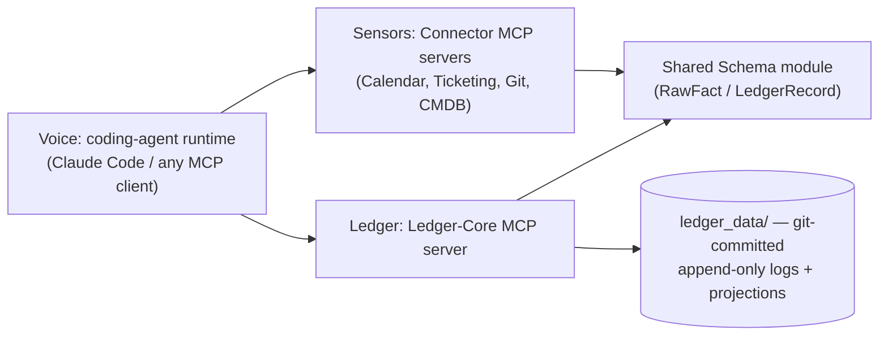
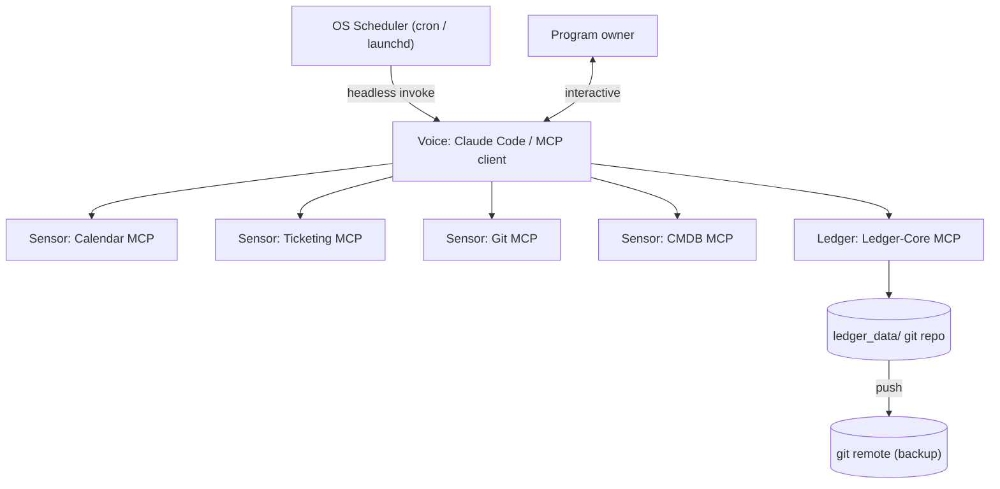

# Architecture Spine — Rez Ops

## Design Paradigm

**Sensors–Ledger–Voice.** Three layers, each an MCP-server boundary:

- **Sensors** (`connectors/`) — one dumb, read-only, domain-scoped MCP server per data source (calendar, ticketing, git, CMDB). Fetch and normalize; no freshness, confidence, or ownership logic.
- **Ledger** (`ledger_core/`) — one MCP server, sole owner of the Freshness Ledger: computation, confidence/coverage scoring, ownership arbitration, orphan-risk detection, drafted outbound content.
- **Voice** (external) — the orchestrating coding-agent runtime (Claude Code, or any MCP-compatible client). Calls Sensors and Ledger, presents output. Holds no domain logic of its own — this is what keeps Rez Ops portable across runtimes.

## Invariants & Rules



Connectors and Ledger-Core never call each other directly — the Runtime mediates all data flow between them, and both depend only on the shared schema, never on each other.

### AD-1 — Sensors–Ledger–Voice layering

- **Binds:** all
- **Prevents:** freshness/confidence/ownership logic leaking into connectors, or into runtime-specific prompts/skills — either breaks consistency and cross-runtime portability.
- **Rule:** connectors are dumb, stateless, read-only fetch-and-normalize MCP servers. Ledger-core is the sole owner of the Freshness Ledger and all derived computation. The runtime only orchestrates calls and presents output; it holds no domain logic. Enforced by code review, not tooling: domain logic (freshness rules, confidence computation, ownership inference) may only live inside a connector or ledger-core tool implementation, never in a skill/prompt/system-instruction file.

### AD-2 — One MCP server per domain, never a monolith

- **Binds:** all connector and core components
- **Prevents:** a single server accreting mixed responsibilities and bloating every session's tool/context budget (every connected server's tools load into every session); two independently-built connectors colliding on tool names in the runtime's shared namespace.
- **Rule:** each data domain ships as its own MCP server with a minimal, domain-scoped toolset. Ledger-core is likewise its own server. A new domain means a new connector server — never extending an existing server's scope. Every tool name is domain-prefixed (e.g. `calendar_list_items`, `cmdb_get_item`), and each server's MCP registration key is fixed to its domain slug.

### AD-3 — Append-only state, materialized projection

- **Binds:** ledger-core
- **Prevents:** silent, unaudited edits to freshness/ownership state that destroy the history the trust layer depends on.
- **Rule:** every state change is appended as an immutable, timestamped event to a git-committed, per-artifact-type log. Current state is always a pure, recomputed projection over that log — never hand-edited in place.

### AD-4 — One shared schema module

- **Binds:** connectors, ledger-core
- **Prevents:** each connector inventing its own shape for observed data, producing facts ledger-core can't merge.
- **Rule:** one shared, versioned schema module defines every record shape (see AD-9 for its two distinct shapes). Every connector and ledger-core import it; none declares ad hoc fields.

### AD-5 — Ledger-core owns confidence/coverage

- **Binds:** ledger-core only
- **Prevents:** connectors independently guessing confidence scores with inconsistent methodology, undermining the never-hide-uncertainty non-negotiable.
- **Rule:** confidence/coverage values are computed exclusively by ledger-core, from raw connector facts, using one documented method. Connectors report only raw timestamps and records — never a confidence score.

### AD-6 — Draft-not-send output boundary

- **Binds:** ledger-core, any future write-capable connector
- **Prevents:** an accidental or later-added write-back path bypassing the human-approval non-negotiable; two writers to one drafts directory.
- **Rule:** any agent-authored outbound content is written only to a git-tracked `drafts/` queue as a pending record, and only by calling ledger-core's write tool — never by a direct filesystem write from any other component. No component calls an external send/write API directly in v1.

### AD-7 — Local-first operational envelope

- **Binds:** all
- **Prevents:** assuming hosted infrastructure that would lock Rez Ops to one runtime or require more than a laptop and a git remote; a scheduled run failing silently; connector credentials leaking into git.
- **Rule:** v1 runs entirely local-first — no hosted database, no container orchestration, no persistent server process. Durability comes from a git remote, pushed after each session. Scheduled work (e.g. a daily briefing) is triggered by the OS scheduler (cron/launchd) invoking `claude -p --mcp-config .mcp.json --output-format json` (not `--bare`, which skips MCP-server autodiscovery entirely and would run the briefing with no Sensors or Ledger attached). A failed scheduled run appends an error entry to `ledger_data/_ops.log.md` rather than failing silently. Each connector's credential comes from the OS keychain or a per-connector env var named `REZOPS_{DOMAIN}_TOKEN`, never from `rezops.config.yaml` or any git-tracked file. Any MCP-client-capable coding-agent runtime can host the same servers unmodified.

### AD-8 — Graceful degradation

- **Binds:** all
- **Prevents:** Rez Ops ever blocking, replacing, or degrading the DR program below today's manual baseline if it is itself wrong, down, or a connector fails.
- **Rule:** every runtime-facing operation fails open — a connector or ledger-core outage surfaces as an explicit `unknown`/unverified state, never a crash that blocks the human. No component or AD may require Rez Ops to be running for the underlying DR program to function; Rez Ops is additive observation, never a dependency of the program it observes.

### AD-9 — Shared schema split: RawFact vs. LedgerRecord

- **Binds:** connectors, ledger-core, shared schema module
- **Prevents:** connectors asserting computed/owned fields (confidence, `tier_sla`) that only ledger-core may set; loss of the source-provenance trail required for compliance/CISO adoption.
- **Rule:** the shared schema module defines two distinct shapes. **RawFact** (connector-writable): raw observed data plus a `source` reference back to the origin system/record — never a confidence value. **LedgerRecord** (ledger-core-only, computed): `last_verified`, `verification_method`, `expiry_rule`, `tier_sla`, `escalation_owner`, `confidence` (`agent-verified` \| `manual` \| `unknown`). `tier_sla` specifically is computed by ledger-core from `rezops.config.yaml` policy inputs — a connector reporting `tier_sla` as an observed fact is a schema violation.

### AD-10 — Ownership arbitration

- **Binds:** ledger-core
- **Prevents:** silent last-write-wins ownership conflicts when two connectors report contradictory values for the same entity; the ownership-inference wedge feature staying unimplemented prose instead of a real rule.
- **Rule:** ledger-core assigns exactly one authoritative connector per ownership-bearing field per entity (a per-field ownership map — e.g. the HRIS/org-chart connector is authoritative for `escalation_owner` over the ticketing connector). A conflicting `RawFact` from a non-authoritative source is logged but never overwrites the authoritative value. Total absence of any authoritative signal escalates that field to `confidence: unknown` and adds the entity to the orphan-risk list, rather than guessing.

## Consistency Conventions

| Concern | Convention |
| --- | --- |
| Naming (entities, files, interfaces, events) | Artifact types keyed by domain (`bia`, `tiering`, `runbooks`, `raci`, `test_records`). Ledger records at `ledger_data/{artifact-type}/{artifact-id}.yaml`. Append-only logs at `ledger_data/{artifact-type}.log.md`, memlog-style. Tool names domain-prefixed per AD-2. |
| Data & formats (ids, dates, error shapes, envelopes) | Dates: ISO 8601 UTC. `RawFact` records carry a `source` reference; `LedgerRecord` fields per AD-9 are computed-only. IDs are stable slugs, never reused. |
| State & cross-cutting (mutation, errors, logging, config, auth) | All mutation goes through ledger-core's single append-only writer (AD-3). Every write records actor, timestamp, and reason. Unverifiable data escalates to `confidence: unknown` (AD-10) — never silently dropped. Scheduled-run failures log to `ledger_data/_ops.log.md` (AD-7). Connector credentials come from the OS keychain or `REZOPS_{DOMAIN}_TOKEN` env vars — never from `rezops.config.yaml` or git. |

## Stack

| Name | Version |
| --- | --- |
| Python | 3.13+ (3.12 is already security-only maintenance) |
| `mcp` (Python MCP SDK) | 1.29.x, pinned `<2` (v2.0.0 GA shipped 2026-07-28, too new to build on) |
| Claude Code (reference runtime) | must support project-scoped `.mcp.json` and `-p --mcp-config --output-format json` headless mode; verify via `claude --version` at build time — confirmed current as of 2026-08-12 research pass |
| git | local repo + private remote (e.g. GitHub) — sole persistence layer, no database |

## Structural Seed



```text
rez-ops/
  shared/
    ledger_schema/     # AD-4/AD-9: RawFact + LedgerRecord shapes, imported by connectors + ledger-core
  connectors/
    calendar/          # Sensor MCP server
    ticketing/         # Sensor MCP server
    git_repo/          # Sensor MCP server
    cmdb/              # Sensor MCP server
  ledger_core/         # Ledger MCP server: computation, confidence, ownership arbitration, drafts
  ledger_data/         # AD-3: append-only logs + materialized state, git-committed
    bia/
    tiering/
    runbooks/
    raci/
    test_records/
    drafts/            # AD-6: pending outbound content, written only via ledger-core's write tool
    _ops.log.md        # AD-7: scheduled-run failure log
  .mcp.json            # project-scoped MCP server registration
  rezops.config.yaml   # enabled connectors, tier SLA policy (inputs only — AD-9)
```

## Deferred

- **Briefing delivery channel** (Slack, email, terminal) — the brief already scopes this as a swappable view; decide on first real usage.
- **Write-back/auto-actioning, Blast Radius Rewind scoreboard, proactive micro-drills** — explicitly out of v1 scope per the brief.
- **Packaging** (personal config vs. installable product for other DR practitioners) — explicitly left open in the brief.
- **Favoring fewer, high-trust, provenance-ranked sources over breadth** — explicit brief constraint on future connector growth; no connector-count ceiling enforced yet.
- **Passive-observation, watch-only baselining period** — explicitly out of v1 scope per the brief.
- **Git remote push/conflict handling strategy** — fine to leave silent for a single-owner v1; revisit once multi-session/multi-device usage produces an actual conflict.
- **Specific vendor adapters** (which calendar/ticketing/CMDB product) — not yet specified; AD-2/AD-9 keep the connector interface vendor-agnostic so a concrete adapter slots in later without redesign.
- **Exact confidence-scoring formula** — AD-5 fixes who owns it, not the method; that's implementation detail owned by the code once written.
- **MCP SDK v2 migration** — v2 shipped 2026-07-28, too new to commit to; revisit once the spec/SDK settle.
- **Multi-user/multi-tenant support** — v1 is single-owner, per the brief's primary user.
