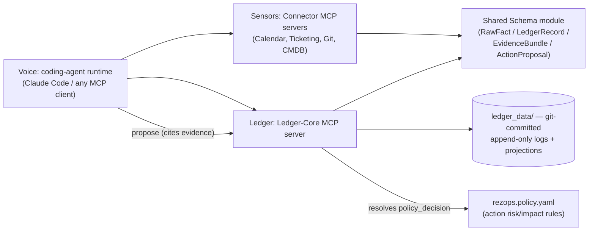
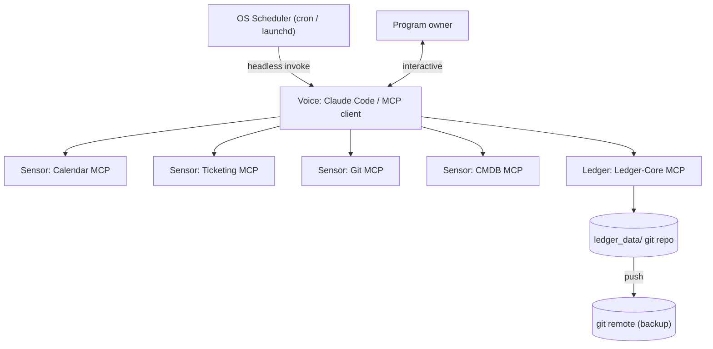

# Architecture Spine — Rez Ops

## Design Paradigm

**Sensors–Ledger–Voice.** Three layers, each an MCP-server boundary:

- **Sensors** (`connectors/`) — one dumb, read-only, domain-scoped MCP server per data source (calendar, ticketing, git, CMDB). Fetch and normalize; no freshness, confidence, or ownership logic.
- **Ledger** (`ledger_core/`) — one MCP server, sole owner of the Freshness Ledger: computation, confidence/coverage scoring, ownership arbitration, orphan-risk detection, drafted outbound content, evidence bundles, and action-proposal policy evaluation.
- **Voice** (external) — the orchestrating coding-agent runtime (Claude Code, or any MCP-compatible client). Calls Sensors and Ledger, presents output, and may cite facts as evidence or propose an action — but never computes confidence, policy, or any other derived value itself. Holds no domain logic of its own — this is what keeps Rez Ops portable across runtimes.

Read-only observation (Sensors → Ledger → Voice) remains the default and everything the first ten ADs describe. AD-11 and AD-12 add a second, explicitly-gated capability — Voice may *propose* a claim (Evidence) or an action (ActionProposal) — without changing anything about how facts are observed or state is derived. Nothing in this spine builds an Executor: a policy decision is recorded, never acted on (see AD-12).

## Invariants & Rules



Connectors and Ledger-Core never call each other directly — the Runtime mediates all data flow between them, and both depend only on the shared schema, never on each other. Voice may *call* ledger-core to propose evidence or an action; it never computes the policy decision that results — that stays ledger-core's alone, same as confidence (AD-5).

### AD-1 — Sensors–Ledger–Voice layering

- **Binds:** all
- **Prevents:** freshness/confidence/ownership logic leaking into connectors, or into runtime-specific prompts/skills — either breaks consistency and cross-runtime portability.
- **Rule:** connectors are dumb, stateless, read-only fetch-and-normalize MCP servers. Ledger-core is the sole owner of the Freshness Ledger and all derived computation. The runtime only orchestrates calls and presents output; it holds no domain logic. Enforced by code review, not tooling: domain logic (freshness rules, confidence computation, ownership inference, policy evaluation) may only live inside a connector or ledger-core tool implementation, never in a skill/prompt/system-instruction file. **Read-only by default; action is an explicit, separately-gated capability** — Voice may assemble a claim (AD-11) or propose an action (AD-12) by calling a ledger-core tool, but the tool's *evaluation* of that claim or proposal is ledger-core's alone; Voice reasoning over facts is not domain logic, Voice computing a policy or confidence value would be.

Specialized reasoning framing (a "risk," "compliance," or "resilience" lens) is a prompt/persona Voice adopts, never a separate code-level component — it fails this spine's own inclusion test (not an independently-built unit that could diverge from another), so it gets no AD and is out of scope here.

### AD-2 — One MCP server per domain, never a monolith

- **Binds:** all connector and core components
- **Prevents:** a single server accreting mixed responsibilities and bloating every session's tool/context budget (every connected server's tools load into every session); two independently-built connectors colliding on tool names in the runtime's shared namespace.
- **Rule:** each data domain ships as its own MCP server with a minimal, domain-scoped toolset. Ledger-core is likewise its own server. A new domain means a new connector server — never extending an existing server's scope. Every tool name is domain-prefixed (e.g. `calendar_list_items`, `cmdb_get_item`), and each server's MCP registration key is fixed to its domain slug.

### AD-3 — Append-only state, materialized projection

- **Binds:** ledger-core
- **Prevents:** silent, unaudited edits to freshness/ownership state that destroy the history the trust layer depends on.
- **Rule:** every state change is appended as an immutable, timestamped event to a git-committed, per-artifact-type log. Current state is always a pure, recomputed projection over that log — never hand-edited in place.

### AD-4 — One shared schema module

- **Binds:** connectors, ledger-core
- **Prevents:** each connector inventing its own shape for observed data, producing facts ledger-core can't merge.
- **Rule:** one shared, versioned schema module defines every record shape (see AD-9 for its two distinct shapes). Every connector and ledger-core import it; none declares ad hoc fields.

### AD-5 — Ledger-core owns confidence/coverage

- **Binds:** ledger-core only
- **Prevents:** connectors independently guessing confidence scores with inconsistent methodology, undermining the never-hide-uncertainty non-negotiable.
- **Rule:** confidence/coverage values are computed exclusively by ledger-core, from raw connector facts, using one documented method. Connectors report only raw timestamps and records — never a confidence score.

### AD-6 — Draft-not-send output boundary

- **Binds:** ledger-core, any future write-capable connector
- **Prevents:** an accidental or later-added write-back path bypassing the human-approval non-negotiable; two writers to one drafts directory.
- **Rule:** any agent-authored outbound content is written only to a git-tracked `drafts/` queue as a pending record, and only by calling ledger-core's write tool — never by a direct filesystem write from any other component. No component calls an external send/write API directly in v1. A `Draft` is human-readable message content a person sends manually; it is never used to represent a proposed system-state-changing operation — that is `ActionProposal`'s distinct shape (AD-12), not a variant of this one.

### AD-7 — Local-first operational envelope

- **Binds:** all
- **Prevents:** assuming hosted infrastructure that would lock Rez Ops to one runtime or require more than a laptop and a git remote; a scheduled run failing silently; connector credentials leaking into git.
- **Rule:** v1 runs entirely local-first — no hosted database, no container orchestration, no persistent server process. Durability comes from a git remote, pushed after each session. Scheduled work (e.g. a daily briefing) is triggered by the OS scheduler (cron/launchd) invoking `claude -p --mcp-config .mcp.json --output-format json` (not `--bare`, which skips MCP-server autodiscovery entirely and would run the briefing with no Sensors or Ledger attached). A failed scheduled run appends an error entry to `ledger_data/_ops.log.md` rather than failing silently. Each connector's credential comes from the OS keychain or a per-connector env var named `REZOPS_{DOMAIN}_TOKEN`, never from `rezops.config.yaml` or any git-tracked file. Any MCP-client-capable coding-agent runtime can host the same servers unmodified.

### AD-8 — Graceful degradation

- **Binds:** all
- **Prevents:** Rez Ops ever blocking, replacing, or degrading the DR program below today's manual baseline if it is itself wrong, down, or a connector fails.
- **Rule:** every runtime-facing operation fails open — a connector or ledger-core outage surfaces as an explicit `unknown`/unverified state, never a crash that blocks the human. No component or AD may require Rez Ops to be running for the underlying DR program to function; Rez Ops is additive observation, never a dependency of the program it observes.

### AD-9 — Shared schema split: RawFact vs. LedgerRecord

- **Binds:** connectors, ledger-core, shared schema module
- **Prevents:** connectors asserting computed/owned fields (confidence, `tier_sla`) that only ledger-core may set; loss of the source-provenance trail required for compliance/CISO adoption.
- **Rule:** the shared schema module defines two distinct shapes. **RawFact** (connector-writable): raw observed data plus a `source` reference back to the origin system/record — never a confidence value. **LedgerRecord** (ledger-core-only, computed): `last_verified`, `verification_method`, `expiry_rule`, `tier_sla`, `escalation_owner`, `confidence` (`agent-verified` \| `manual` \| `unknown`). `tier_sla` specifically is computed by ledger-core from `rezops.config.yaml` policy inputs — a connector reporting `tier_sla` as an observed fact is a schema violation.

### AD-10 — Ownership arbitration

- **Binds:** ledger-core
- **Prevents:** silent last-write-wins ownership conflicts when two connectors report contradictory values for the same entity; the ownership-inference wedge feature staying unimplemented prose instead of a real rule.
- **Rule:** ledger-core assigns exactly one authoritative connector per ownership-bearing field per entity (a per-field ownership map — e.g. the HRIS/org-chart connector is authoritative for `escalation_owner` over the ticketing connector). A conflicting `RawFact` from a non-authoritative source is logged but never overwrites the authoritative value. Total absence of any authoritative signal escalates that field to `confidence: unknown` and adds the entity to the orphan-risk list, rather than guessing.

### AD-11 — Evidence boundary

- **Binds:** shared schema module, ledger-core, Voice
- **Prevents:** a reasoning-layer claim ("this runbook looks stale") existing only as unattributed prose — undermining never-hide-uncertainty at the reasoning layer the same way an unattributed fact would at the data layer; Voice indirectly controlling an action's approval by self-supplying the confidence score AD-12's policy evaluation reads — the same loophole AD-12 exists to close, one layer up.
- **Rule:** the shared schema module adds `EvidenceBundle` (`claim`, `confidence: float 0–1`, `evidence: list[EvidenceRef]`, `reasoning`, `generated_at`). `EvidenceRef` is a structured object, never a bare string — `{source: str` (a `RawFact.source`-shaped reference) `, field: str | None}` (the specific `LedgerRecord` field being cited, set only when the evidence is a computed value rather than a raw fact). Voice supplies `claim`, `reasoning`, and the list of `EvidenceRef`s when calling ledger-core's evidence tool. **Ledger-core — never Voice — computes `confidence`**, server-side, from the cited evidence, using one documented method (exact formula deferred, same pattern as AD-5's confidence formula) — a caller-supplied `confidence` value is a schema violation, exactly as a connector-supplied `tier_sla` already is (AD-9). `EvidenceBundle.confidence` (claim-level plausibility) remains a distinct concept from `LedgerRecord.confidence`'s `agent-verified`/`manual`/`unknown` enum (AD-5); the two are never conflated. Persisted one file per bundle at `ledger_data/evidence/{evidence_id}.md`, created-only (no update/delete) — a bundle is never itself approved or denied, only cited by an `ActionProposal` (AD-12), so it needs no lifecycle beyond creation and mirrors `Draft`'s simple one-shot pattern (AD-6), not AD-3's log-and-projection pattern.

### AD-12 — ActionProposal and the Policy Engine

- **Binds:** ledger-core, shared schema module, Voice
- **Prevents:** the LLM ever deciding for itself whether an action is permitted — the one property this layer exists to guarantee; conflating drafted human content (AD-6) with a structured, policy-evaluated system operation, which need different shapes and different eventual consumers; two implementations silently diverging on how an approval/denial gets recorded.
- **Rule:** `ActionProposal` (`action`, `target: artifact_type/artifact_id`, `reason`, `evidence: list[EvidenceBundle id]`, `impact`, `policy_decision`) is created by Voice calling a new ledger-core tool, naming `action` from the fixed vocabulary that is **exactly the set of top-level keys declared in `rezops.policy.yaml`** — never freeform, never any other source, discoverable by Voice by reading that same file — and citing at least one `EvidenceBundle`; a proposal naming an undeclared action, or citing no evidence, is invalid and rejected before anything is appended. Unlike `Draft`/`EvidenceBundle` (one file, created-only), an `ActionProposal` has a real lifecycle — proposed, then decided — so it extends AD-3's append-only/projection discipline to a single project-wide log, `ledger_data/action_proposals.log.md` (proposals aren't themselves an artifact type in the `RawFact` sense, so this is one flat log, not a per-artifact-type one): a `proposed` event when Voice creates it, immediately followed by a `decided` event carrying `policy_decision` appended by the same tool call (there is no later, separate human-approval step in this phase — see Never below); current state is always a pure projection over that log, never a hand-edited field on an in-place record.
- **Ledger-core — never Voice — computes `policy_decision`** (`automatic` | `requires_approval` | `denied`), using one documented method (exact thresholds deferred, same pattern as AD-5), from: the named action's config-declared risk/impact in `rezops.policy.yaml` (kept separate from `rezops.config.yaml`'s tiering/connector inputs — AD-2's one-responsibility-per-surface lesson applies to config files too); the target's criticality (from its `LedgerRecord.tier_sla` once computed, AD-9 — a target with no existing `LedgerRecord` at all resolves to the most conservative criticality tier, never a guessed default, mirroring AD-10's escalate-rather-than-guess precedent); and the **minimum** confidence across every cited `EvidenceBundle` (the most cautious evidence sets the ceiling — never an average, and never the caller's choice of which to weight). A caller-supplied `policy_decision` is a schema violation, exactly as a connector-supplied `confidence`/`tier_sla` already is (AD-5/AD-9).
- **Never:** no executor exists in this phase, and nothing may act on `policy_decision` regardless of its value — not an external write/send API call, not an internally-triggered `Draft` creation (AD-6), not any other component's write path. `automatic` today means only "would need no human sign-off if an Executor existed" — it triggers exactly nothing. Building an Executor that actually consumes a `policy_decision` to perform an action is a separate, later architectural decision requiring its own AD before any code writes externally or internally on this signal.

## Consistency Conventions

| Concern | Convention |
| --- | --- |
| Naming (entities, files, interfaces, events) | Artifact types keyed by domain (`bia`, `tiering`, `runbooks`, `raci`, `test_records`). Ledger records at `ledger_data/{artifact-type}/{artifact-id}.yaml`. Append-only logs at `ledger_data/{artifact-type}.log.md`, memlog-style. Tool names domain-prefixed per AD-2. `EvidenceBundle` one-file-per-bundle at `ledger_data/evidence/{evidence_id}.md`, created-only (AD-11), mirroring `drafts/`'s convention. `ActionProposal` instead extends AD-3's log+projection discipline to one flat log, `ledger_data/action_proposals.log.md` (`proposed`/`decided` events, AD-12) — it has a lifecycle, `EvidenceBundle`/`Draft` don't. |
| Data & formats (ids, dates, error shapes, envelopes) | Dates: ISO 8601 UTC. `RawFact` records carry a `source` reference; `LedgerRecord` fields per AD-9 are computed-only. IDs are stable slugs, never reused. `EvidenceBundle.confidence` (claim plausibility, float, ledger-core-computed) is never conflated with `LedgerRecord.confidence` (verification-state enum) — AD-11. `EvidenceRef` is a structured `{source, field}` object, never a bare string. |
| State & cross-cutting (mutation, errors, logging, config, auth) | All mutation goes through ledger-core's single append-only writer (AD-3). Every write records actor, timestamp, and reason. Unverifiable data escalates to `confidence: unknown` (AD-10) — never silently dropped. Scheduled-run failures log to `ledger_data/_ops.log.md` (AD-7). Connector credentials come from the OS keychain or `REZOPS_{DOMAIN}_TOKEN` env vars — never from `rezops.config.yaml` or git. `policy_decision` is computed exclusively by ledger-core from `rezops.policy.yaml`, using the minimum confidence across cited evidence (never an average) — never asserted by Voice, and is recorded-only — no executor consumes it (AD-12). The action-identifier vocabulary is exactly `rezops.policy.yaml`'s top-level keys — no other source, no freeform names. |

## Stack

| Name | Version |
| --- | --- |
| Python | 3.13+ (3.12 is already security-only maintenance) |
| `mcp` (Python MCP SDK) | 1.29.x, pinned `<2` (v2.0.0 GA shipped 2026-07-28, too new to build on) |
| Claude Code (reference runtime) | must support project-scoped `.mcp.json` and `-p --mcp-config --output-format json` headless mode; verify via `claude --version` at build time — confirmed current as of 2026-08-12 research pass |
| git | local repo + private remote (e.g. GitHub) — sole persistence layer, no database |

## Structural Seed



```text
rez-ops/
  shared/
    ledger_schema/     # AD-4/AD-9/AD-11: RawFact + LedgerRecord + EvidenceBundle shapes, imported by connectors + ledger-core
  connectors/
    calendar/          # Sensor MCP server
    ticketing/         # Sensor MCP server
    git_repo/          # Sensor MCP server
    cmdb/              # Sensor MCP server
  ledger_core/         # Ledger MCP server: computation, confidence, ownership arbitration, drafts, evidence, policy evaluation
  ledger_data/         # AD-3: append-only logs + materialized state, git-committed
    bia/
    tiering/
    runbooks/
    raci/
    test_records/
    drafts/            # AD-6: pending outbound content, written only via ledger-core's write tool
    evidence/                 # AD-11: EvidenceBundle records, one file per bundle, created-only
    action_proposals.log.md   # AD-12: proposed/decided events (incl. policy_decision); current state is a projection, same pattern as AD-3
    _ops.log.md        # AD-7: scheduled-run failure log
  .mcp.json            # project-scoped MCP server registration
  rezops.config.yaml   # enabled connectors, tier SLA policy (inputs only — AD-9)
  rezops.policy.yaml   # AD-12: per-action risk/impact + required-approval rules — inputs only, ledger-core evaluates
```

## Deferred

- **Briefing delivery channel** (Slack, email, terminal) — the brief already scopes this as a swappable view; decide on first real usage.
- **The Executor** (actually performing a policy-approved `ActionProposal` against an external system) — `policy_decision` is computed and recorded (AD-12), but nothing consumes it to act; requires its own future architectural decision once deliberately chosen, not a default extrapolation from AD-12 existing.
- **Blast Radius Rewind scoreboard, proactive micro-drills** — explicitly out of v1 scope per the brief.
- **Packaging** (personal config vs. installable product for other DR practitioners) — explicitly left open in the brief.
- **Favoring fewer, high-trust, provenance-ranked sources over breadth** — explicit brief constraint on future connector growth; no connector-count ceiling enforced yet.
- **Passive-observation, watch-only baselining period** — explicitly out of v1 scope per the brief.
- **Git remote push/conflict handling strategy** — fine to leave silent for a single-owner v1; revisit once multi-session/multi-device usage produces an actual conflict.
- **Specific vendor adapters** (which calendar/ticketing/CMDB product) — not yet specified; AD-2/AD-9 keep the connector interface vendor-agnostic so a concrete adapter slots in later without redesign.
- **Exact confidence-scoring formula** — AD-5 fixes who owns it, not the method; that's implementation detail owned by the code once written.
- **MCP SDK v2 migration** — v2 shipped 2026-07-28, too new to commit to; revisit once the spec/SDK settle.
- **Multi-user/multi-tenant support** — v1 is single-owner, per the brief's primary user.
- **`rezops.policy.yaml`'s exact per-action fields and `policy_decision`'s exact risk/criticality thresholds** — AD-12 fixes who owns evaluating policy (ledger-core), that the action vocabulary is exactly the file's top-level keys, and that confidence aggregates by minimum — not the exact numeric thresholds or which actions exist yet; that's implementation detail owned by the code once written, same pattern as AD-5's confidence formula.
- **`LedgerRecord.tier_sla` actually being computed** — AD-12's criticality signal depends on it; AD-9 already defers the formula, and AD-12 doesn't invent a new criticality source ahead of that — a target with no `tier_sla` yet resolves to the most conservative tier (AD-12), not a guess.
- **`EvidenceBundle.confidence`'s exact computation method** — AD-11 fixes who computes it (ledger-core, never Voice), not the formula; same deferral pattern as AD-5.
