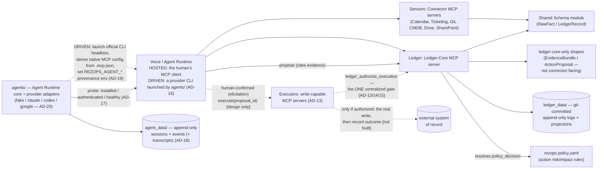
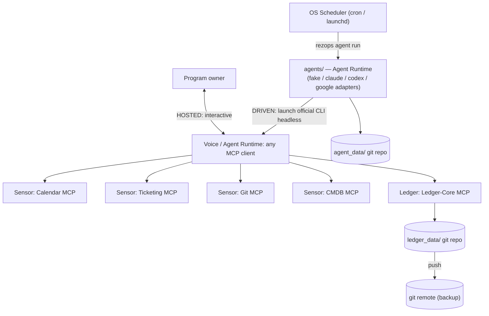

# Architecture Spine — Rez Ops

## Design Paradigm

**Sensors–Ledger–Voice.** Three layers, each an MCP-server boundary:

- **Sensors** (`connectors/`) — one dumb, read-only, domain-scoped MCP server per data source (calendar, ticketing, git, CMDB). Fetch and normalize; no freshness, confidence, or ownership logic.
- **Ledger** (`ledger_core/`) — one MCP server, sole owner of the Freshness Ledger: computation, confidence/coverage scoring, ownership arbitration, orphan-risk detection, drafted outbound content, evidence bundles, and action-proposal policy evaluation.
- **Voice / Agent Runtime** — whichever MCP-capable agent runtime sits in front of Rez Ops. In **Hosted** mode it is the human's own MCP client (Claude Code today) loading Rez Ops's servers; in **Driven** mode Rez Ops's own agent runtime (`agents/`) launches a provider's official local CLI headless — Claude Code, Codex, Antigravity CLI, or the fake — against the same server set (AD-16). Either way it calls Sensors and Ledger, presents output, and may cite facts as evidence or propose an action — but never computes confidence, policy, or any other derived value itself, and no provider is ever a system of record (AD-1, AD-20). Holds no domain logic of its own — this is what keeps Rez Ops portable across runtimes.

Read-only observation (Sensors → Ledger → Voice) remains the default and everything the first ten ADs describe. AD-11 and AD-12 add a second, explicitly-gated capability — Voice may *propose* a claim (Evidence) or an action (ActionProposal) — without changing anything about how facts are observed or state is derived. AD-13 through AD-15 design (but do not build) a third layer on top: **Executors**, a new write-capable component category that would eventually consume an approved `policy_decision` to perform an action for real. Nothing in this spine builds one yet — a policy decision is recorded, never acted on, until a future story deliberately implements AD-13/14/15 (see Deferred).

AD-16 through AD-20 open the next generation: Voice becomes a provider-neutral **Agent Runtime** that Rez Ops can also *drive* — launching a subscription-authenticated local CLI headless — without changing one thing about how facts are observed, state is derived, or actions are gated. The agent runtime is a peer of `ops/`, never part of the Ledger; its own state lives in `agent_data/` (AD-18); its claims enter the Ledger only through the AD-11/AD-12 tools, stamped with environment-attested provenance (AD-19); what a provider can do is probed, never declared (AD-17); and every adapter obeys one contract whose method signatures are deliberately left to the Phase 1 spike (AD-20). Phase ownership is explicit: **Phase 1** builds `agents/` (core, the four adapters, `agent_data/`, the `rezops` CLI) and changes nothing in `ledger_core/` — it only *sets* the AD-19 environment; **Phase 3** carries the ledger-core half (provenance stamping on every write, the policy-file hash on `decided`, the shared failure enum in `shared/`). Missions, routing, multi-agent review, and the typed domain model are named under Deferred with the phase that owns each.

## Invariants & Rules



Connectors and Ledger-Core never call each other directly — the Runtime mediates all data flow between them, and both depend only on the shared schema, never on each other. Voice may *call* ledger-core to propose evidence or an action; it never computes the policy decision that results — that stays ledger-core's alone, same as confidence (AD-5). The agent runtime (`agents/`) and ledger-core likewise never call each other and share no store: `agents/` writes only `agent_data/`, ledger-core writes only `ledger_data/`, and the only thing that crosses between them is a provider session calling the same MCP tools a human would (AD-16/AD-18).

### AD-1 — Sensors–Ledger–Voice layering

- **Binds:** all
- **Prevents:** freshness/confidence/ownership logic leaking into connectors, or into runtime-specific prompts/skills — either breaks consistency and cross-runtime portability; a single vendor's agent runtime becoming load-bearing for Rez Ops's state.
- **Rule:** connectors are dumb, stateless, read-only fetch-and-normalize MCP servers. Ledger-core is the sole owner of the Freshness Ledger and all derived computation. The runtime only orchestrates calls and presents output; it holds no domain logic. Enforced by code review, not tooling: domain logic (freshness rules, confidence computation, ownership inference, policy evaluation) may only live inside a connector or ledger-core tool implementation, never in a skill/prompt/system-instruction file. **Read-only by default; action is an explicit, separately-gated capability** — Voice may assemble a claim (AD-11) or propose an action (AD-12) by calling a ledger-core tool, but the tool's *evaluation* of that claim or proposal is ledger-core's alone; Voice reasoning over facts is not domain logic, Voice computing a policy or confidence value would be. "Voice" throughout this spine means **Voice / Agent Runtime in either mode** (AD-16) — the name is kept for continuity with fifteen ADs and twenty stories; the plan's "Agent Runtime" is the same thing. **The runtime is never a system of record**: no provider — Claude Code, Codex, Antigravity CLI, or any successor — is load-bearing for Rez Ops's state; every fact, claim, decision, and action lives in `ledger_data/` and is fully reconstructable with any or all providers gone.

Specialized reasoning framing (a "risk," "compliance," or "resilience" lens) is a prompt/persona Voice adopts, never a separate code-level component — it fails this spine's own inclusion test (not an independently-built unit that could diverge from another), so it gets no AD and is out of scope here.

### AD-2 — One MCP server per domain, never a monolith

- **Binds:** all connector and core components
- **Prevents:** a single server accreting mixed responsibilities and bloating every session's tool/context budget (every connected server's tools load into every session); two independently-built connectors colliding on tool names in the runtime's shared namespace.
- **Rule:** each data domain ships as its own MCP server with a minimal, domain-scoped toolset. Ledger-core is likewise its own server. A new domain means a new connector server — never extending an existing server's scope. Every tool name is domain-prefixed (e.g. `calendar_list_items`, `cmdb_get_item`), and each server's MCP registration key is fixed to its domain slug.

### AD-3 — Append-only state, materialized projection

- **Binds:** ledger-core
- **Prevents:** silent, unaudited edits to freshness/ownership state that destroy the history the trust layer depends on.
- **Rule:** every state change is appended as an immutable, timestamped event to a git-committed, per-artifact-type log. Current state is always a pure, recomputed projection over that log — never hand-edited in place.

### AD-4 — One shared schema module

- **Binds:** connectors, ledger-core
- **Prevents:** each connector inventing its own shape for observed data, producing facts ledger-core can't merge.
- **Rule:** one shared, versioned schema module defines every record shape (see AD-9 for its two distinct shapes). Every connector and ledger-core import it; none declares ad hoc fields.

### AD-5 — Ledger-core owns confidence/coverage

- **Binds:** ledger-core only
- **Prevents:** connectors independently guessing confidence scores with inconsistent methodology, undermining the never-hide-uncertainty non-negotiable.
- **Rule:** confidence/coverage values are computed exclusively by ledger-core, from raw connector facts, using one documented method. Connectors report only raw timestamps and records — never a confidence score.

### AD-6 — Draft-not-send output boundary

- **Binds:** ledger-core, any future write-capable connector
- **Prevents:** an accidental or later-added write-back path bypassing the human-approval non-negotiable; two writers to one drafts directory.
- **Rule:** any agent-authored outbound content is written only to a git-tracked `drafts/` queue as a pending record, and only by calling ledger-core's write tool — never by a direct filesystem write from any other component. No component calls an external send/write API directly in v1. A `Draft` is human-readable message content a person sends manually; it is never used to represent a proposed system-state-changing operation — that is `ActionProposal`'s distinct shape (AD-12), not a variant of this one.

### AD-7 — Local-first operational envelope

- **Binds:** all
- **Prevents:** assuming hosted infrastructure that would lock Rez Ops to one runtime or require more than a laptop and a git remote; a scheduled run failing silently; connector credentials leaking into git.
- **Rule:** v1 runs entirely local-first — no hosted database, no container orchestration, no persistent server process. Durability comes from a git remote, pushed after each session. Scheduled work (e.g. a daily briefing) is triggered by the OS scheduler (cron/launchd) invoking the agent runtime in Driven mode against `.mcp.json` (AD-16); the literal provider invocation — today `claude -p --mcp-config .mcp.json --output-format json`, never `--bare`, which skips MCP-server autodiscovery and would run the briefing with no Sensors or Ledger attached — is the claude adapter's implementation detail (AD-20), not the architecture. The agent runtime is invoked per run and exits; it is never a resident daemon, and a future mission scheduler (Deferred) must not become one by accident. A provider process lives only for the duration of the one `rezops agent run` that launched it, under a wall-clock budget (`AGENT_TIMEOUT`); the runtime never keeps a provider process alive between invocations — resume re-launches through the provider's own native resume and the Rez Ops `session_id` (AD-18). A failed run never fails silently: a Driven-mode failure is a `session.failed` event in `agent_data/` plus a non-zero exit from `rezops agent run` (AD-18 — `agents/` never writes `ledger_data/`); `ledger_data/_ops.log.md` remains the failure log only for the legacy `ops/` scripts until they are retired. `ops/run_scheduled_briefing.py` hard-codes `claude -p` and is therefore a **named, grandfathered exception to AD-20 §3** for exactly as long as it takes Phase 1 to make it a thin shim over `rezops agent run --provider claude` — it is not a pattern to copy. Each connector's credential comes from the OS keychain or a per-connector env var named `REZOPS_{DOMAIN}_TOKEN`, never from `rezops.config.yaml` or any git-tracked file. Provider-runtime credentials (a vendor CLI's own login) are owned by that runtime and never appear in any Rez Ops config, env var, or log (AD-20); the `REZOPS_*` namespace additionally carries the AD-19 provenance vars, set only by the agent runtime launcher. Any MCP-client-capable coding-agent runtime can host the same servers unmodified.

### AD-8 — Graceful degradation

- **Binds:** all
- **Prevents:** Rez Ops ever blocking, replacing, or degrading the DR program below today's manual baseline if it is itself wrong, down, or a connector fails.
- **Rule:** every runtime-facing operation fails open — a connector or ledger-core outage surfaces as an explicit `unknown`/unverified state, never a crash that blocks the human. No component or AD may require Rez Ops to be running for the underlying DR program to function; Rez Ops is additive observation, never a dependency of the program it observes.

### AD-9 — Shared schema split: RawFact vs. LedgerRecord

- **Binds:** connectors, ledger-core, shared schema module
- **Prevents:** connectors asserting computed/owned fields (confidence, `tier_sla`) that only ledger-core may set; loss of the source-provenance trail required for compliance/CISO adoption.
- **Rule:** the shared schema module defines two distinct shapes. **RawFact** (connector-writable): raw observed data plus a `source` reference back to the origin system/record — never a confidence value. **LedgerRecord** (ledger-core-only, computed): `last_verified`, `verification_method`, `expiry_rule`, `tier_sla`, `escalation_owner`, `confidence` (`agent-verified` \| `manual` \| `unknown`). `tier_sla` specifically is computed by ledger-core from `rezops.tiers.yaml` policy inputs — a connector reporting `tier_sla` as an observed fact is a schema violation.

### AD-10 — Ownership arbitration

- **Binds:** ledger-core
- **Prevents:** silent last-write-wins ownership conflicts when two connectors report contradictory values for the same entity; the ownership-inference wedge feature staying unimplemented prose instead of a real rule.
- **Rule:** ledger-core assigns exactly one authoritative connector per ownership-bearing field per entity (a per-field ownership map — e.g. the HRIS/org-chart connector is authoritative for `escalation_owner` over the ticketing connector). A conflicting `RawFact` from a non-authoritative source is logged but never overwrites the authoritative value. Total absence of any authoritative signal escalates that field to `confidence: unknown` and adds the entity to the orphan-risk list, rather than guessing.

### AD-11 — Evidence boundary

- **Binds:** shared schema module, ledger-core, Voice
- **Prevents:** a reasoning-layer claim ("this runbook looks stale") existing only as unattributed prose — undermining never-hide-uncertainty at the reasoning layer the same way an unattributed fact would at the data layer; Voice indirectly controlling an action's approval by self-supplying the confidence score AD-12's policy evaluation reads — the same loophole AD-12 exists to close, one layer up.
- **Rule:** the schema adds `EvidenceBundle` (`claim`, `confidence: float 0–1`, `evidence: list[EvidenceRef]`, `reasoning`, `generated_at`) — implemented in `ledger_core/`, not `shared/ledger_schema/`, since nothing here is connector-writable or connector-relevant (only Voice ever creates one, via ledger-core); `Draft` (AD-6), the closest precedent, already lives outside `shared/` for the same reason. `EvidenceRef` is a structured object, never a bare string — `{artifact_type: str, artifact_id: str, source: str | None, field: str | None}`, exactly one of `source`/`field` set. `source` is a `RawFact.source`-shaped reference; `field` names the specific `LedgerRecord` field being cited, set only when the evidence is a computed value rather than a raw fact. Both the artifact reference and the source/field must match together — a citation naming one artifact resolves only against *that artifact's own* recorded events or record, never any other artifact of the same type. Voice supplies `claim`, `reasoning`, and the list of `EvidenceRef`s when calling ledger-core's evidence tool. **Ledger-core — never Voice — computes `confidence`**, server-side, from the cited evidence, using one documented method (exact formula deferred, same pattern as AD-5's confidence formula) — a caller-supplied `confidence` value is a schema violation, exactly as a connector-supplied `tier_sla` already is (AD-9). `EvidenceBundle.confidence` (claim-level plausibility) remains a distinct concept from `LedgerRecord.confidence`'s `agent-verified`/`manual`/`unknown` enum (AD-5); the two are never conflated. Persisted one file per bundle at `ledger_data/evidence/{evidence_id}.md`, created-only (no update/delete) — a bundle is never itself approved or denied, only cited by an `ActionProposal` (AD-12), so it needs no lifecycle beyond creation and mirrors `Draft`'s simple one-shot pattern (AD-6), not AD-3's log-and-projection pattern.

### AD-12 — ActionProposal and the Policy Engine

- **Binds:** ledger-core, shared schema module, Voice
- **Prevents:** the LLM ever deciding for itself whether an action is permitted — the one property this layer exists to guarantee; conflating drafted human content (AD-6) with a structured, policy-evaluated system operation, which need different shapes and different eventual consumers; two implementations silently diverging on how an approval/denial gets recorded.
- **Rule:** `ActionProposal` (`action`, `target: artifact_type/artifact_id`, `reason`, `evidence: list[EvidenceBundle id]`, `impact`, `policy_decision`) is created by Voice calling a new ledger-core tool, naming `action` from the fixed vocabulary that is **exactly the set of top-level keys declared in `rezops.policy.yaml`** — never freeform, never any other source, discoverable by Voice by reading that same file — and citing at least one `EvidenceBundle`; a proposal naming an undeclared action, or citing no evidence, is invalid and rejected before anything is appended. Unlike `Draft`/`EvidenceBundle` (one file, created-only), an `ActionProposal` has a real lifecycle — proposed, then decided — so it extends AD-3's append-only/projection discipline to a single project-wide log, `ledger_data/action_proposals.log.md` (proposals aren't themselves an artifact type in the `RawFact` sense, so this is one flat log, not a per-artifact-type one): a `proposed` event when Voice creates it, immediately followed by a `decided` event carrying `policy_decision` appended by the same tool call (there is no later, separate human-approval step in this phase — see Never below); current state is always a pure projection over that log, never a hand-edited field on an in-place record.
- **Ledger-core — never Voice — computes `policy_decision`** (`automatic` | `requires_approval` | `denied`), using one documented method (exact thresholds deferred, same pattern as AD-5), from: the named action's config-declared risk/impact in `rezops.policy.yaml` (kept separate from `rezops.tiers.yaml`'s tiering inputs and `rezops.config.yaml`'s connector inputs — AD-2's one-responsibility-per-surface lesson applies to config files too); the target's criticality (from its `LedgerRecord.tier_sla` once computed, AD-9 — a target with no existing `LedgerRecord` at all resolves to the most conservative criticality tier, never a guessed default, mirroring AD-10's escalate-rather-than-guess precedent); and the **minimum** confidence across every cited `EvidenceBundle` (the most cautious evidence sets the ceiling — never an average, and never the caller's choice of which to weight). A caller-supplied `policy_decision` is a schema violation, exactly as a connector-supplied `confidence`/`tier_sla` already is (AD-5/AD-9). From Phase 3 the `decided` event also records the SHA-256 of the `rezops.policy.yaml` and `rezops.tiers.yaml` it was evaluated against, so "what policy version was used?" is answerable from the log alone.
- **Never:** no executor is *built* in this phase, and nothing built so far may act on `policy_decision` regardless of its value — not an external write/send API call, not an internally-triggered `Draft` creation (AD-6), not any other component's write path. `automatic` today means only "would need no human sign-off if an Executor existed" — it triggers exactly nothing. AD-13/AD-14/AD-15 design the Executor deliberately, as their own dedicated decision, exactly as this clause required — but design is not code: nothing in those ADs is implemented until a story builds it.

### AD-13 — Executors and the centralized authorization gate [DESIGN ONLY — not yet built]

- **Binds:** ledger-core, shared schema module, all Executors, Voice
- **Prevents:** ledger-core accreting per-vendor write/execution code — the exact anti-pattern AD-2 already forbids for Sensors, just on the write side; an Executor independently re-implementing (and potentially misimplementing) the approval/denial/idempotency safety chain, the same centralize-derived-authority principle AD-1/AD-5/AD-9/AD-11/AD-12 already established for every other computed value; two Executor servers both claiming authority over one action name; "explicit human instruction" being an unenforceable convention resting entirely on Voice's own self-report.
- **Rule:** an Executor is a new, domain/action-scoped MCP server (`executors/`, sibling to `connectors/`) — one per action type/vendor, mirroring Sensors' one-server-per-domain pattern (AD-2) but for writes instead of reads. `rezops.policy.yaml` declares exactly one authoritative `executor` per action (a new per-action field, extending AD-10's per-field-single-owner principle to the write side) — two Executor servers claiming the same action is a declared config error, not a runtime race. An Executor never independently decides whether it's allowed to execute: before any real write, it calls one centralized ledger-core tool, `ledger_authorize_execution(proposal_id)` — the sole sanctioned way to address an `ActionProposal` by id (closing the same "no get-by-id" gap already noted in `deferred-work.md`), and the sole place every check happens: `policy_decision` is not `denied`; is `automatic`, or is `requires_approval` with a matching `approved` event (AD-14); and no prior *successful* execution attempt already exists for this `proposal_id` (AD-15). Authorizing appends an `attempted` marker to `action_executions.log.md` at authorization time itself, not after the real write — narrowing, not eliminating, the race window between two concurrent invocations (the residual risk is a named Deferred item, not silently inherited). Only after receiving explicit authorization does the Executor perform the write, then calls a ledger-core tool to record the final outcome (succeeded/failed). Credentials are always separate from any read-only connector's, even for the identical vendor/table (extends AD-7). Execution is only ever invoked following a real, interactive human confirmation at the point of execution — using MCP's own elicitation primitive, not merely because Voice chose to call a tool — so a human is provably in the loop for the one step in this whole system with a real, potentially-irreversible external consequence, not just conversationally instructed. Nothing polls for or auto-fires an `automatic`-decision proposal in this design; autonomous/polled execution is a deliberate later step, not bundled here (see Deferred).

### AD-14 — Approval step: `requires_approval` needs its own recorded, operator-attested event [DESIGN ONLY — not yet built]

- **Binds:** ledger-core, shared schema module
- **Prevents:** collapsing "who approved this" into "who happened to invoke execution," losing the audit distinction the whole evidence/policy layer exists to provide; Voice self-supplying a fabricated approver identity, defeating the entire point of a human-approval gate; a `denied` proposal ever being executed regardless of who insists; an ambiguous second `approved` event silently overwriting the first.
- **Rule:** a `requires_approval` `ActionProposal` needs a new `approved` event (who approved it, when) appended to the same `action_proposals.log.md` (alongside the existing `proposed`/`decided` events, AD-12) via a new ledger-core tool, before `ledger_authorize_execution` (AD-13) will ever authorize it — like `decided`, `approved` is a one-time state change per proposal, not a repeatable attempt, so it extends AD-12's log rather than living in AD-15's execution-attempts log. **`approved`'s `approver` field is never a freeform argument Voice supplies** — it resolves from a fixed, non-Voice-suppliable operator identity — the `REZOPS_OPERATOR` env var, set once by the human operating this installation and shared with AD-19's provenance stamp, the same never-from-an-LLM-suppliable-parameter discipline AD-7 already established for credentials: Rez Ops v1 has exactly one operator (SPEC.md's existing multi-user Non-goal), so "who approved this" can only honestly mean "the person running this session," not a cryptographically-verified third party — that would need a real identity/auth system explicitly out of scope for v1. A second `approved` event for an already-approved `proposal_id` is rejected as corruption, the same precedent Story 13 already established for a duplicate `decided` event. An `automatic`-decision proposal needs no `approved` event (that's what `automatic` means) but still requires the same interactive human confirmation to execute (AD-13). A `denied` proposal is hard-blocked at `ledger_authorize_execution` — no override exists, regardless of who invokes it.

### AD-15 — Execution recording: a separate, retry-aware log [DESIGN ONLY — not yet built]

- **Binds:** ledger-core, shared schema module, any future Executor
- **Prevents:** forcing execution's genuinely-retriable real-world shape (a transient external-API failure, then a retry) into `action_proposals.log.md`'s existing one-event-of-each-type-per-proposal model, which already treats a second `decided` event as corruption (Story 13); a proposal being executed twice successfully with no idempotency guard.
- **Rule:** execution outcomes are recorded in a new, separate append-only log, `ledger_data/action_executions.log.md`, as zero-or-more execution-*attempt* events per `proposal_id` (each carrying outcome attempted/succeeded/failed, timestamp, executor identity, and an external reference such as the created ticket's ID). `ledger_authorize_execution` (AD-13) is the sole writer of the `attempted` event, at authorization time; the Executor itself only ever appends the final succeeded/failed outcome for an attempt it was already authorized to make. A `proposal_id` already carrying a *succeeded* attempt is never authorized again (idempotency); one whose only attempts so far failed may be retried. No automatic rollback/undo of any kind exists or is ever built into an Executor — reversing an executed action, if ever needed, is a manual human action entirely outside this system, the same category as AD-6's send-a-drafted-message-is-manual precedent.

### AD-16 — Two execution modes, one MCP surface

- **Binds:** agent runtime, Voice, ledger-core, connectors
- **Prevents:** two paths into Rez Ops diverging on which tools exist or how a claim enters the Ledger; agent-runtime concerns (sessions, providers, launching) leaking into `ledger_core/`; two hand-maintained MCP server lists drifting apart because the three verified provider CLIs each read a different config surface.
- **Rule:** Rez Ops runs in exactly two modes. **Hosted**: a human's own MCP client loads Rez Ops's servers from `.mcp.json` — today's model, unchanged by this amendment. **Driven**: the agent runtime — a new top-level `agents/` package, a peer of `ops/` and `connectors/`, never inside `ledger_core/` — launches a provider's *official* local CLI headless and gives it the same server set. Both modes reach the Ledger only through the same MCP tools; neither carries domain logic; a driven session is not privileged over a hosted one in any way. `.mcp.json` is the **single source of truth** for the server set in both modes: in Driven mode each adapter *derives* its provider's native MCP configuration from `.mcp.json` at launch (Claude Code reads `.mcp.json` directly via `--mcp-config`; Codex reads TOML; Antigravity CLI reads `.agents/mcp_config.json`, whose stdio entries share `.mcp.json`'s shape — the only kind Rez Ops ships), generated into a per-run, git-ignored location — never hand-maintained, never committed as a second copy — and a provider's *global* MCP config (`~/.codex/config.toml`, `~/.gemini/config/mcp_config.json`) is never allowed to merge extra servers into a driven session (AD-20 §7). An adapter launches the provider **in the project root as its working directory** — ledger-core and the connectors resolve `ledger_data/`, `.mcp.json`, and the `rezops.*.yaml` files relative to it today — never in a temp directory, and never by pointing the provider's *home* (`CODEX_HOME`, `~/.gemini`) elsewhere, which would also relocate its auth. Derived config lives under a git-ignored `.rezops/run/{session_id}/` inside the project root, so two concurrent driven sessions never clobber each other's derivation; concurrent *writes* to `ledger_data/` remain the pre-existing no-file-locking Deferred item, now with a second real writer to motivate it. The Ledger must never orchestrate agents: `agents/` may call ledger-core's MCP tools through a provider session exactly as a human would, but `ledger_core/` never imports, spawns, or awaits anything in `agents/` (AD-1's "the Ledger never depends on an LLM," applied to the runtime layer). AD-7's former literal `claude -p …` clause is now the claude adapter's implementation.

### AD-17 — Provider capabilities are probed, never declared

- **Binds:** every provider adapter, `rezops doctor`, future routing
- **Prevents:** two adapters reporting "available" by different methods; config asserting a capability a runtime no longer has (the Gemini CLI stopped serving individual subscriptions on 2026-06-18; a Codex npm wrapper can be installed with its binary missing; Claude Code's `--print` MCP loading regressed once in 2.1.77) and work being silently routed to a runtime that cannot do it.
- **Rule:** an adapter's report of `installed`, `authenticated`, `healthy`, and its capability set (`mcp`, `headless`, `sessions`, `structured_output`, `auth_mode: SUBSCRIPTION | API`) comes **only** from probing the actual runtime at call time — binary present, version, an authentication check the vendor CLI itself exposes, a real headless round-trip when the caller needs certainty — reading the runtime's structured result, never its exit code alone, since at least one verified runtime exits 0 on a denied tool call. No config file declares what a provider can do; a future `rezops.providers.yaml` holds routing *preferences* only (which provider you would rather use for what), never capability *claims*. `rezops doctor` is the human-facing rendering of the same probe, not a second implementation; by default it probes without launching a provider session, and its opt-in `--live` round-trip is a full driven session — a fixed, write-free prompt — subject to every AD like any other (events, scope, provenance). A provider that fails its probe is reported by explicit cause (AD-20's failure enum) and a task bound for it stays `pending`, visibly. Extends AD-7's "verify Claude Code's capabilities at build time" discipline to run time, for every provider.

### AD-18 — Agent state lives in its own append-only store, `agent_data/`

- **Binds:** agent runtime, ledger-core
- **Prevents:** ledger-core's sole-writer guarantee over `ledger_data/` (AD-3) quietly acquiring a second writer, or the Ledger becoming the store of record for state it never derives; a provider transcript being read as domain truth — "Claude said X" silently becoming "Rez Ops knows X."
- **Rule:** sessions, tasks, and the structured agent event stream (`session.started`, `task.pending`, `task.started`, `tool.called`, `tool.completed`, `agent.message`, `claim.submitted`, `task.completed`, `task.failed`, `session.cancelled`, `session.failed`, `session.completed`) are appended by the agent runtime — and only the agent runtime — to `agent_data/`, as immutable timestamped events with current state a pure projection (AD-3's discipline, different owner, different directory). The line grammar is the one `ledger_data/*.log.md` already uses — one event per line, `ledger_core/log.py`'s format as the reference, so a human reads both stores the same way — and each `event_type`'s `payload` shape is defined once, versioned, in `agents/core`, never ad hoc per adapter. `task.pending` is where a task a provider cannot currently run waits, visibly (AD-17/AD-20). Rez Ops assigns `session_id` (a UUID) *before* launching the provider — it must, to set the AD-19 environment — and records the provider's own native session/thread id as `provider_session_id` on `session.started`; the two are never conflated, and resume/cancel address the Rez Ops id. Every event carries `timestamp`, `session_id`, `provider`, `model` (when the runtime reports it), `mode`, `auth_mode`, `event_type`, `payload` — plus `mission_id`/`task_id` once missions exist — and when the provider that executed differs from the one requested, both are recorded on the session. **No secret ever lands in `agent_data/`**: event payloads record tool names and argument digests, never credential values (connectors take theirs from the environment, not tool arguments, so a compliant payload has none to leak). Raw provider transcripts are **off by default**; when a human opts in for debugging they live under `agent_data/transcripts/`, git-ignored, never committed, consumed by nothing. `agent_data/sessions/` is git-committed and follows AD-7's git-remote durability rule exactly as `ledger_data/` does; the pre-existing gap that nothing yet automates that commit is carried in Deferred, not widened here. **Ledger-core never reads or writes `agent_data/`**, and `agents/` never writes `ledger_data/`. Agent output enters the Ledger only through ledger-core's existing write tools — `ledger_ingest_raw_fact`, `ledger_create_draft`, `ledger_create_evidence`, `ledger_create_action_proposal` — each of which stamps AD-19 provenance, so a fact a driven session *relays* from a Sensor is recorded as relayed-by-that-session, never as unattributed observed truth; no new write tool, no side channel. A persistence migration for either store is Deferred.

### AD-19 — Agent provenance on Ledger writes is environment-attested, never caller-supplied

- **Binds:** agent runtime, ledger-core, every ledger-core write tool (`RawFact` ingest, `Draft`, `EvidenceBundle`, `ActionProposal`)
- **Prevents:** a fake- or wrong-provider-authored claim being indistinguishable from a real one; a driven LLM appending a `RawFact` with an invented `source` that then reads as observed truth — the plan's "Claude said X → Rez Ops knows X" path, which the four existing write tools would otherwise leave open; the first Ledger field an LLM asserts about *itself* — the same forgeable self-report channel AD-14 closed for `approver`.
- **Rule:** ledger-core stamps a `provenance` block — `{session_id, provider, model, mode, auth_mode, operator}` — onto **every record its write tools create**: the `RawFact` event `ledger_ingest_raw_fact` appends, every `Draft`, every `EvidenceBundle`, every `ActionProposal`. The values come from **ledger-core's own process environment, never from a tool argument**. In Driven mode the agent runtime sets `REZOPS_AGENT_SESSION_ID`, `REZOPS_AGENT_PROVIDER`, `REZOPS_AGENT_MODE=driven`, and `REZOPS_AGENT_AUTH_MODE` when it launches the provider CLI; each adapter is responsible for guaranteeing that the ledger-core process the CLI spawns inherits them — confirmed per adapter in the Phase 1 spike, since at least one verified runtime whitelists the environment it passes to MCP children — and it forwards environment **by name, never by value**: no adapter ever writes a `REZOPS_*` credential or provenance *value* into a generated config file to get it through. An adapter that cannot forward by name fails the launch (`PROVENANCE_UNAVAILABLE`) rather than falling back to values-in-a-file or provenance-as-an-argument. Ledger-core treats the four variables as all-or-nothing: a partial or malformed set is `PROVENANCE_INVALID` and the write is refused — it never falls open to `mode: hosted`. The `tests/providers/` contract suite includes the end-to-end check that a record written from a driven session carries exactly that session's stamp. Same never-LLM-suppliable discipline as AD-7's credentials and AD-14's operator identity. This AD's ledger-core half (the stamp) is **Phase 3** work; Phase 1 only sets the variables and must not touch `ledger_core/`. In Hosted mode no launcher exists, so the vars are absent and ledger-core stamps `mode: hosted` with `operator` read from `REZOPS_OPERATOR` — the single operator-identity variable this spine names, set once by the human operating the installation, and the same variable AD-14's `approver` resolves from; absent, `operator: unknown` is stamped, never a guess. A caller-supplied provenance value is a schema violation, exactly as a connector-supplied `tier_sla` (AD-9) or a caller-supplied `confidence` (AD-11) already is. `provenance` is **required on write, optional on read**: every record written from Phase 3 on carries it, and every record written before reads back as `provenance: null` — a legacy `EvidenceBundle` or `ActionProposal` is never rejected, never downgraded to the confidence-0 sentinel, and never poisons the flat proposals log for lacking a key that did not exist when it was written. Consequence for the fake provider: anything it authors carries `provider: fake` by construction, so the plan's "no fake implementations" rule is honoured by making the fake *loud*, not by banning it.

### AD-20 — Provider adapter contract: invariants fixed, method signatures deferred to the Phase 1 spike

- **Binds:** every provider adapter (`agents/providers/*`), agent runtime core, future routing
- **Prevents:** two adapters diverging on credential handling, failure reporting, tool scope, or what they emit; a vendor's CLI name, flag, or binary appearing anywhere outside its own adapter; an LLM choosing which provider runs; a driven agent that read prompt-injected external content having any path to act outside the Ledger's gated tools.
- **Rule:** the exact `AgentProvider` interface (`health`, `capabilities`, `start_session`, `send_task`, `resume_session`, `cancel_session`, `stream_events`, `get_result`, `get_usage` are the plan's *candidates*) is designed **after** the Phase 1 spike inspects the real runtimes — "do not prematurely implement fake abstractions." What is fixed now is the contract every adapter must satisfy: **(1)** an adapter launches the vendor's *official* local runtime and never extracts, proxies, converts, stores, or logs its credentials, never scrapes a private web session, and never bypasses or games a vendor's rate or usage limits — authentication and quota belong to the provider runtime, and Rez Ops knows only the AD-17 probe results. **(2)** `auth_mode` is recorded on every session as `SUBSCRIPTION | API` (the plan's `LOCAL_SUBSCRIPTION`, shortened — same concept), never hidden; `SUBSCRIPTION` is the primary development mode and `API` is an explicit per-provider opt-in. The adapter *probes* which mode the runtime will actually use (AD-17) and *refuses to launch* (`AUTH_MODE_MISMATCH`) if the probe says `API` without that provider's opt-in — an ambient vendor API key sitting in the shell never silently turns a subscription session into a billed one. **(3)** Vendor CLI names, flags, binaries, and config formats appear *only* inside that provider's adapter package — `ledger_core/`, `connectors/`, `shared/`, and `agents/core/` never reference a provider. **(4)** Every adapter emits the AD-18 event stream and reports failure with a code from the **one system-wide failure enum** — housed in `agents/core` during Phase 1 (which may not touch `shared/`) and relocated, same closed set, into `shared/` in Phase 3 beside the connector, ledger, and policy codes (the module every component already imports, AD-4) — agent codes (`PROVIDER_NOT_INSTALLED`, `AUTHENTICATION_FAILED`, `AGENT_UNAVAILABLE`, `AGENT_TIMEOUT`, `AGENT_QUOTA_EXHAUSTED`, `RATE_LIMITED`, `AGENT_OUTPUT_INVALID`, `MCP_ATTACH_FAILED`, `TOOL_SCOPE_VIOLATION`, `PROVENANCE_UNAVAILABLE`, `PROVENANCE_INVALID`) alongside the connector, ledger, and policy codes the plan lists (`CONNECTOR_UNAVAILABLE`, `LEDGER_UNAVAILABLE`, `POLICY_REJECTED`, `APPROVAL_REQUIRED`, `EVIDENCE_INVALID`, `AUTH_MODE_MISMATCH`) — never "unknown error". The enum is a **closed set** in code at any moment: adding a code is a change to `shared/` with a test, and the ellipses in this document are elision, not an open-ended license. A driven launch whose `.mcp.json` servers do not all attach **fails the session with `MCP_ATTACH_FAILED`**; it never runs silently degraded with fewer Sensors than the human would have (AD-8's fail-open means explicit `unknown`, not quiet omission). A provider that cannot execute leaves the task `pending` and visible, never silently failed. **(5)** Provider selection is deterministic and inspectable — config preferences plus AD-17 probe results — never an LLM's choice; when the executed provider differs from the requested one, both are recorded (AD-18). **(6)** The `fake` adapter is a real, shipped adapter that passes the same `tests/providers/` contract suite as every other, and can be configured to inject any failure code from the shared enum so the runtime's handling of each is tested without a live vendor — it is the contract's executable definition and fault injector, not a stub. It is the one adapter exempt from §1's "official runtime": it runs **in-process**, launching no binary, simulating a provider session end to end; when a test needs it to reach Rez Ops's MCP tools (Phase 3) it does so through a real MCP client with the AD-19 environment set, which is how `provider: fake` stamps arise — always against an isolated test project root, never the repository's own `ledger_data/`. **Phase 1 story order is fixed by dependency**: `agents/core` + `fake` + the contract suite land first and define the interface; `claude` second (the only adapter with a live-verified headless path today); `codex` and `google` after, each against the same suite. **(7)** A driven session's tool scope is defined provider-neutrally as the set of `(server, tool)` pairs exposed by exactly the servers in `.mcp.json` — nothing else. Each adapter enforces it three ways: it launches the provider in its **strict / isolated MCP-config mode** so the provider's user- or global-scope MCP config can never merge extra servers in (Claude Code: `--strict-mcp-config`; Codex and Antigravity: the equivalent isolation the spike confirms — an adapter without one fails the launch); it denies the provider's built-in shell, file-write, and web tools through the provider's own permission mechanism and never passes a skip-all-permissions flag; and **before the first task it verifies the provider's reported loaded-server set equals `.mcp.json`'s**, failing the session with `TOOL_SCOPE_VIOLATION` on any difference. A provider's own tool-naming scheme (Claude's `mcp__<server>__<tool>`) is that adapter's concern (§3), never the scope's definition. Hosted mode is the human's own session and is not constrained by clause 7.

## Consistency Conventions

| Concern | Convention |
| --- | --- |
| Naming (entities, files, interfaces, events) | Artifact types keyed by domain (`bia`, `tiering`, `runbooks`, `raci`, `test_records`). Ledger records at `ledger_data/{artifact-type}/{artifact-id}.yaml`. Append-only logs at `ledger_data/{artifact-type}.log.md`, memlog-style. Tool names domain-prefixed per AD-2. `EvidenceBundle` one-file-per-bundle at `ledger_data/evidence/{evidence_id}.md`, created-only (AD-11), mirroring `drafts/`'s convention. `ActionProposal` instead extends AD-3's log+projection discipline to one flat log, `ledger_data/action_proposals.log.md` (`proposed`/`decided` events, AD-12) — it has a lifecycle, `EvidenceBundle`/`Draft` don't. |
| Data & formats (ids, dates, error shapes, envelopes) | Dates: ISO 8601 UTC. `RawFact` records carry a `source` reference; `LedgerRecord` fields per AD-9 are computed-only. IDs are stable slugs, never reused. `EvidenceBundle.confidence` (claim plausibility, float, ledger-core-computed) is never conflated with `LedgerRecord.confidence` (verification-state enum) — AD-11. `EvidenceRef` is a structured `{artifact_type, artifact_id, source, field}` object, never a bare string — a citation resolves only against that same artifact, never any other of the same type. |
| State & cross-cutting (mutation, errors, logging, config, auth) | All mutation goes through ledger-core's single append-only writer (AD-3). Every write records actor, timestamp, and reason. Unverifiable data escalates to `confidence: unknown` (AD-10) — never silently dropped. Scheduled-run failures log to `ledger_data/_ops.log.md` (AD-7). Connector credentials come from the OS keychain or `REZOPS_{DOMAIN}_TOKEN` env vars — never from `rezops.config.yaml` or git. `policy_decision` is computed exclusively by ledger-core from `rezops.policy.yaml`, using the minimum confidence across cited evidence (never an average) — never asserted by Voice (AD-12). No executor exists yet to consume it; AD-13/14/15 design (not build) the one centralized gate, `ledger_authorize_execution`, that would ever let anything act on it. The action-identifier vocabulary is exactly `rezops.policy.yaml`'s top-level keys — no other source, no freeform names; each action also declares exactly one authoritative `executor` (AD-13). |
| Agent runtime (modes, events, provenance, failures) | Two modes, `hosted` \| `driven` (AD-16). `agents/` is a Python package plus the `rezops` CLI, not an MCP server — AD-2 governs servers; the runtime is an MCP *client launcher*. Agent events append to `agent_data/sessions/{session_id}.log.md`, memlog-style, each carrying `timestamp, session_id, provider, model, mode, auth_mode, event_type, payload` (+ `mission_id`/`task_id` once missions exist); raw transcripts opt-in only, at `agent_data/transcripts/{session_id}.*`, git-ignored, read by nothing; event payloads carry tool names and argument digests, never credential values (AD-18). Provenance env vars, set only by the launcher: `REZOPS_AGENT_SESSION_ID`, `REZOPS_AGENT_PROVIDER`, `REZOPS_AGENT_MODE`, `REZOPS_AGENT_AUTH_MODE`; ledger-core reads them from its own environment and stamps `provenance {session_id, provider, model, mode, auth_mode, operator}` on every record a write tool creates — `RawFact` ingest, `Draft`, `EvidenceBundle`, `ActionProposal`; absent vars mean `mode: hosted` + AD-14 operator (AD-19, Phase 3). Failures use the one system-wide enum in `shared/` (`PROVIDER_NOT_INSTALLED`, `AUTHENTICATION_FAILED`, `AGENT_UNAVAILABLE`, `AGENT_TIMEOUT`, `AGENT_QUOTA_EXHAUSTED`, `RATE_LIMITED`, `AGENT_OUTPUT_INVALID`, …), never "unknown error"; a task a provider cannot run stays `pending`, visibly (AD-17/AD-20). Everything a Sensor returns (titles, ticket text, document metadata) and everything a provider emits is **untrusted data, never instructions** — the reason AD-20 §7 exists and why every claim is validated by ledger-core (AD-11/12/19). Driven-mode tool scope is the `(server, tool)` set from `.mcp.json`, enforced by strict MCP-config mode + built-in-tool denial + a loaded-server-set check before the first task (`TOOL_SCOPE_VIOLATION`) (AD-20 §7). Providers launch with the project root as cwd; derived configs at git-ignored `.rezops/run/{session_id}/`; env forwarded by name, never by value; partial `REZOPS_AGENT_*` = `PROVENANCE_INVALID`, write refused (AD-16/AD-19). |

## Stack

| Name | Version |
| --- | --- |
| Python | 3.13+ (3.12 is already security-only maintenance) |
| `mcp` (Python MCP SDK) | 1.30.0 is the latest 1.x (security fixes only); 2.2.0 (2026-09-07) is now the default install. Pinned `>=1.29,<2` — adapters launch CLIs and never import the SDK, so nothing in AD-16–20 touches it; v2 migration is revisited before Phase 3 (Deferred). |
| Claude Code (reference runtime; `claude` adapter) | 2.1.269 verified live 2026-09-12: `-p --mcp-config .mcp.json --strict-mcp-config --output-format stream-json` loads all 7 Rez Ops servers (18 tools); `--session-id`/`--resume` for sessions. Re-probe every run (AD-17) — issue anthropics/claude-code#38987 showed this exact capability regress once (2.1.77, 2026-03). |
| OpenAI Codex CLI (`codex` adapter) | `codex exec` headless, `--json` JSONL events, `--output-schema`, `codex exec resume`; ChatGPT-subscription login via `codex login` (device auth), tokens in `~/.codex/auth.json` which Rez Ops never reads; MCP via `config.toml` (derived per AD-16); read-only sandbox by default. Verified from vendor docs 2026-09-12; pin the npm `@openai/codex` version when the adapter is built. |
| Google Antigravity CLI `agy` (`google` adapter) | The individual-subscription route since 2026-06-18 — Gemini CLI no longer serves Google AI Pro/Ultra. `-p`, `--output-format text\|json\|stream-json`, `--continue`/`--conversation <id>`; cached credentials from one interactive login, headless exits non-zero when unauthenticated; MCP via `.agents/mcp_config.json` (same `mcpServers`/`command`/`args` shape as `.mcp.json` for stdio servers — all 7 Rez Ops servers are stdio; remote entries differ, `serverUrl` vs `url`; derived per AD-16); headless tools soft-deny unless `permissions.allow` — never `--dangerously-skip-permissions`. **A denied tool call still exits 0 with `status: SUCCESS` (stderr notice only)** — the adapter must judge health and tool scope from the JSON envelope and denial notices, never from the exit code (AD-17). Verified from vendor docs 2026-09-12: v1.2.0, generally available, releasing roughly weekly — pin when the adapter is built. |
| git | local repo + private remote (e.g. GitHub) — sole persistence layer, no database |

## Structural Seed



```text
rez-ops/
  shared/
    ledger_schema/     # AD-4/AD-9: RawFact + LedgerRecord shapes, imported by connectors + ledger-core
    failures/          # AD-20 §4 [Phase 3]: the one system-wide failure enum (connector / ledger / agent / policy codes)
  connectors/
    calendar/          # Sensor MCP server
    ticketing/         # Sensor MCP server
    git_repo/          # Sensor MCP server
    cmdb/              # Sensor MCP server
  executors/           # AD-13 [design only, not yet built]: write-capable siblings of Sensors, one per action type/vendor
    ticketing/           # e.g. a future create_ticket executor -- credentials separate from connectors/ticketing/
  ledger_core/         # Ledger MCP server: computation, confidence, ownership arbitration, drafts, evidence, policy evaluation
  agents/              # AD-16/AD-20: Agent Runtime -- a peer of ops/, never inside ledger_core/; an MCP *client launcher*, not a server
    core/              # session lifecycle, event emission (AD-18), provenance env (AD-19), agent failure codes [Phase 1 home, -> shared/failures in Phase 3], contract types
    providers/         # AD-20: one adapter package per provider; vendor CLI names/flags/config formats live ONLY here
      fake/            # the contract's executable definition -- passes the same tests/providers/ suite as every real adapter
      claude/          # Claude Code: claude -p ... (AD-7's former literal clause lives here now)
      codex/           # OpenAI Codex CLI: codex exec ...
      google/          # Google Antigravity CLI: agy -p ... (NOT the retired Gemini CLI subscription route)
    sessions/          # AD-18 projections over agent_data/
  agent_data/          # AD-18: the agent runtime's own append-only store -- ledger-core never reads or writes it
    sessions/          # {session_id}.log.md: session / task / tool / claim events
    transcripts/       # opt-in raw provider transcripts, git-ignored, debugging only, consumed by nothing
  ledger_data/         # AD-3: append-only logs + materialized state, git-committed
    bia/
    tiering/
    runbooks/
    raci/
    test_records/
    drafts/            # AD-6: pending outbound content, written only via ledger-core's write tool
    evidence/                 # AD-11: EvidenceBundle records, one file per bundle, created-only
    action_proposals.log.md   # AD-12: proposed/decided events (incl. policy_decision), built; + AD-14 approved event [design only, not yet built]; current state is a projection, same pattern as AD-3
    action_executions.log.md  # AD-15 [design only, not yet built]: zero-or-more execution-attempt events per proposal_id
    _ops.log.md        # AD-7: scheduled-run failure log
  docs/
    product-direction.md          # the plan AD-16..20 distil
    architecture-next.md          # Phase 0 deliverable: this amendment's delta, for implementers
    provider-adapter-contract.md  # Phase 0 deliverable: AD-17/18/19/20 as an adapter author's checklist
  tests/
    providers/         # AD-20 clause 6: the shared adapter contract suite (fake + every real adapter)
  pyproject.toml       # [project.scripts] rezops -> `rezops doctor` (AD-17), `rezops agent run --provider X` (AD-16)
  .rezops/run/         # AD-16: git-ignored per-session derived provider configs, {session_id}/ -- never a hand-maintained second server list
  .mcp.json            # project-scoped MCP server registration -- the SINGLE source of truth for the server set in both modes (AD-16)
  rezops.config.yaml   # enabled connectors (inputs only — AD-9)
  rezops.tiers.yaml    # Story 17/CAP-11: tier vocabulary + per-artifact tier assignments (inputs only — AD-9)
  rezops.policy.yaml   # AD-12: per-action risk/impact + required-approval rules — inputs only, ledger-core evaluates
```

Not created in Phase 0/1, by design: `domain/`, `skills/`, `ui/`, `agents/missions/`, `agents/routing/`, `rezops.providers.yaml`. Each arrives with the phase that owns it (see Deferred). The `ops/` scripts stay where they are until a concrete architectural reason moves them.

## Deferred

- **Exact `AgentProvider` signatures, per-provider MCP-config derivation, and permission-scoping flags** — AD-20 fixes the contract's invariants, AD-16 fixes that `.mcp.json` is the source of truth, AD-20 §7 fixes the tool scope; *how* each adapter derives Codex's TOML or Antigravity's `.agents/mcp_config.json`, and which exact flags deny a provider's built-in tools, is the Phase 1 spike's job — the plan's own instruction is to design the interface after inspecting the real runtimes.
- **An LLM-free Sensor → Ledger relay** — today Voice relays every `RawFact` from a Sensor into `ledger_ingest_raw_fact` (AD-1: "the Runtime mediates all data flow"), so a fact's arrival in the Ledger always passes through an LLM. AD-19 makes that relay attributable, not absent. The plan's §28 ideal — facts reach the Ledger without an LLM in the path — would amend AD-1's mediation rule and is its own decision, after Phase 3 shows how much relayed-fact noise driven sessions actually produce.
- **Missions and Tasks** (plan §24/25, Phase 4) — revisit after Phase 3's exit criterion holds (each provider answers "what is the current DR readiness?" through the same MCP tools). **Conflict carried forward, surfaced now:** the plan's mission shape carries its own `approvals` field, but this spine has exactly one approval mechanism — AD-12's `policy_decision` plus AD-14's `approved` event. A mission may *cite* `ActionProposal` ids; it never owns a parallel approval state. The future mission AD must say so explicitly.
- **Provider routing** (plan §22/48, Phase 6) — AD-20 §5 fixes the invariant (deterministic, inspectable, never LLM-chosen, requested-vs-executed recorded); the `rezops.providers.yaml` preferences schema and the router itself are Phase 6. Phase 1 builds no routing.
- **Mission scheduler with types, retry, priority, dependencies** (plan §26) — AD-7 still says no resident process; the OS scheduler invoking `rezops agent run` is the whole scheduler until a concrete requirement forces more, and any richer scheduler must not become a daemon by accident.
- **Multi-agent reasoning, roles, and independent challenge** (plan §23/46/47, Phase 13) — the orchestrator would be a Driven-mode consumer of AD-16/18/20; nothing about it is decided here.
- **Agent skills** (plan §43–45, Phase 5) — Voice-side prompt packaging, the same category as the existing "specialised reasoning framing" non-AD above; revisit only if a skill needs code rather than prose.
- **Observability and the default timeout budget** (plan §55) — AD-7 fixes that every provider process has a wall-clock budget and AD-18 fixes that every run leaves an event trail; the default budget value, metrics, and any dashboard over `agent_data/` are Phase 2 detail. `approval.requested` as an agent event arrives with Missions (Phase 4), where an approval has a mission to belong to; `docs/security-model.md` (plan §78) is written when Phase 1 has real adapters to describe.
- **`API` execution mode** — AD-20 §2 names it as an explicit opt-in so it is never hidden; nothing builds it until a user chooses it for a provider.
- **Typed domain model, dependency intelligence, DR test management, Findings and Lessons Learned, document-content ingestion** (plan §7/12/13/15/16/33, Phases 8–11) — each changes the generic `artifact_type`/`artifact_id` substrate or the metadata-only connector boundary and needs its own threat-modelled AD, exactly as `roadmap.md` already states; none is decided by this amendment.
- **Persistence migration** (SQLite / DuckDB / Postgres, plan §40) — revisit only when `agent_data/` or `ledger_data/` scale forces it; the append-only constraint is kept as a design asset, not a limitation.
- **Hosted / multi-user deployment** (plan §77, Phase 15) — an explicit later architectural phase, never a side effect of adding a UI; v1 remains single-operator (AD-14).
- **Briefing delivery channel** (Slack, email, terminal) — the brief already scopes this as a swappable view; decide on first real usage.
- **Building the Executor** — AD-13/14/15 design the interface (a new `executors/` component category, the `approved` event, the execution-attempts log) deliberately, per AD-12's own Never clause; no code exists yet. The first real target, once built, is `create_ticket` against ServiceNow (already declared `impact: low`, and this project already has a proven read-only integration to mirror the auth/HTTP pattern from) — `disable_credential` stays firmly out of any "first executable" scope given its `high` impact and lack of any real undo.
- **Autonomous/polled execution** of an `automatic`-decision proposal — AD-13 explicitly rules this out for now; every execution requires a deliberate human invocation naming one `proposal_id`, even one already decided `automatic`. A scheduled/polled executor (mirroring `ops/run_scheduled_briefing.py`) is a deliberate later step, not bundled into the first Executor.
- **A `rejected` event, distinct from simply "not yet approved"** — AD-14 designs `approved` for a `requires_approval` proposal a human accepts, but doesn't resolve whether a human explicitly *declining* one needs its own recorded event (vs. just never approving it, which looks identical to "not yet reviewed"). Revisit once a real approval workflow is actually built.
- **Exact tool names, log line formats, and executor-credential env-var naming for AD-13/14/15** — the ADs fix the boundaries and invariants, not the literal schema; that's implementation detail for whichever story builds this, same pattern as every other "exact formula/format deferred" item above.
- **The residual race window in `ledger_authorize_execution`'s idempotency check** — appending the `attempted` marker at authorization time (AD-13/15) narrows, but doesn't provably eliminate, the window between two concurrent invocations for the same `proposal_id` racing before either's outcome is recorded. Same root category as the project's existing no-file-locking deferral, called out explicitly here (not silently inherited) given a double-executed external write is a more visible failure than a merely-interleaved log line.
- **Verifying MCP's elicitation primitive against the pinned SDK version at build time** — AD-13 leans on it for the interactive human-confirmation step; confirmed to exist in the current MCP spec during this session's version-currency review, but the API differs between the pinned 1.x line (`ctx.elicit`; 1.30.0 is current, `uv.lock` still resolves 1.29.0 — bump it as Phase 0 housekeeping, two security-only releases behind) and 2.x's resolver-based form, so it needs re-checking when a story actually builds this, the same "verify capability at build time" discipline AD-7 already applies to Claude Code's own headless/`.mcp.json` capabilities.
- **Blast Radius Rewind scoreboard, proactive micro-drills** — explicitly out of v1 scope per the brief.
- **Packaging** (personal config vs. installable product for other DR practitioners) — explicitly left open in the brief.
- **Favoring fewer, high-trust, provenance-ranked sources over breadth** — explicit brief constraint on future connector growth; no connector-count ceiling enforced yet.
- **Passive-observation, watch-only baselining period** — explicitly out of v1 scope per the brief.
- **Git remote push/conflict handling strategy, and automating the commit itself** — fine to leave silent for a single-owner v1; revisit once multi-session/multi-device usage produces an actual conflict. Note the reviewer-observed fact that `ledger_data/` has no tracked files today: AD-7's "pushed after each session" is a human step nobody automated. `agent_data/` inherits the same rule and the same gap; a `rezops` command that commits both on session end is the natural Phase 1 or Phase 2 fix.
- **Specific vendor adapters** (which calendar/ticketing/CMDB product) — not yet specified; AD-2/AD-9 keep the connector interface vendor-agnostic so a concrete adapter slots in later without redesign.
- **Exact confidence-scoring formula** — AD-5 fixes who owns it, not the method; that's implementation detail owned by the code once written.
- **MCP SDK v2 migration** — v2 is now the stable default (2.2.0, 2026-09-07; 1.x is security-fixes only). Nothing in AD-16–20 imports the SDK, so the `<2` pin holds through Phase 0/1; revisit **before Phase 3** (agent ↔ MCP integration), where the 1.x/2.x elicitation API difference AD-13 leans on would first bite.
- **`rezops.policy.yaml`'s exact per-action fields and `policy_decision`'s exact risk/criticality thresholds** — AD-12 fixes who owns evaluating policy (ledger-core), that the action vocabulary is exactly the file's top-level keys, and that confidence aggregates by minimum — not the exact numeric thresholds or which actions exist yet; that's implementation detail owned by the code once written, same pattern as AD-5's confidence formula.
- ~~**`LedgerRecord.tier_sla` actually being computed**~~ — **Resolved by Story 17 (CAP-11).** `ledger_core/projection.py`'s `get_record`/`list_records` now compute `tier_sla`/`expiry_rule`/`risk` from `rezops.tiers.yaml`'s declared tier vocabulary + per-artifact assignments, x freshness (`last_verified`) x `confidence` — never accepted as connector/caller input. A target with no declared tier still resolves to the most conservative reading (`tier_sla=None`, `risk="unknown"`), never a guess, exactly as AD-12 anticipated.
- **`EvidenceBundle.confidence`'s exact computation method** — AD-11 fixes who computes it (ledger-core, never Voice), not the formula; same deferral pattern as AD-5.
