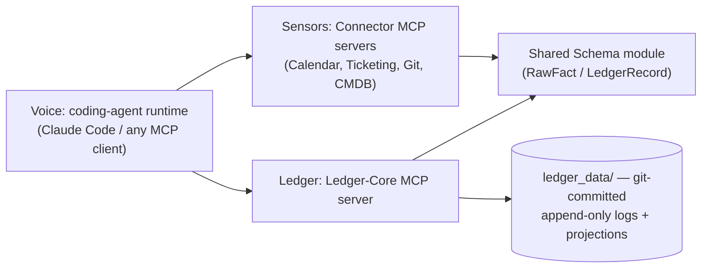
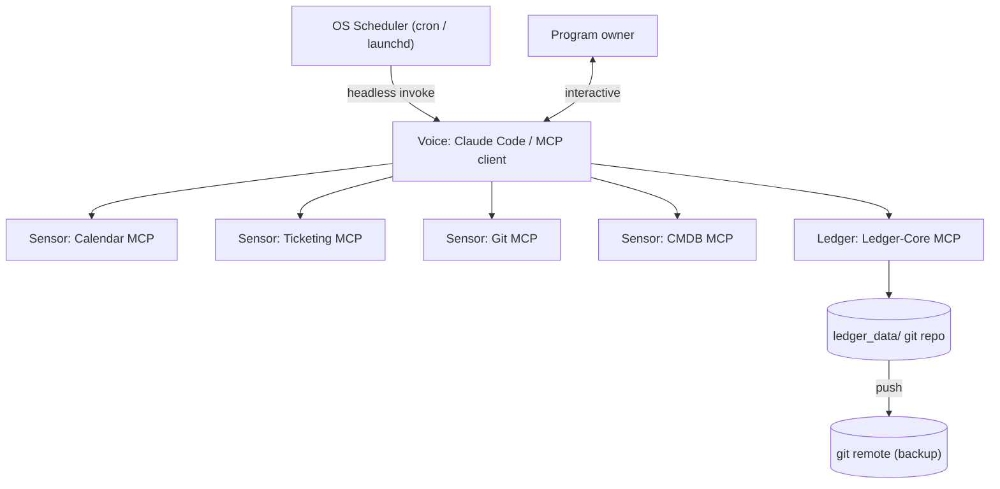

# Solution Design — Rez Ops

> This is the companion explainer to `ARCHITECTURE-SPINE.md`. The spine itself is terse, declarative, and free of rationale — written to be built from. This document exists to answer the question the spine deliberately doesn't: *why does it look like this?* Nothing here overrides the spine — where the two seem to disagree, the spine wins. Read this if you're Olu six weeks from now wondering why an AD says what it says, or if you're handing this to a collaborator who needs the reasoning, not just the rule.

## Overview

Rez Ops is an AI agent that manages a Disaster Recovery (DR) program without becoming yet another place for the program's data to live and go stale. DR programs at large, always-on organizations are accountable for a sprawl of artifacts — Business Impact Analyses (BIAs), application/service tiering, runbooks, RACI ownership records, test schedules — scattered across a CMDB, a ticketing system, a wiki, a spreadsheet, and someone's memory. None of those systems know when their own data has gone stale. A BIA doesn't know it's 18 months overdue for review; a RACI doc doesn't know its "Accountable" owner left the company two reorgs ago. Because reconstructing the program's true state is manual and slow, it only actually gets done under pressure — right before an audit, or right after an incident already proved the gap was real.

Rez Ops closes that gap not by building a new system of record (every AI-flavored competitor in this space does that, and it's a trap — whoever owns the data owns the lock-in), but by connecting, read-only, to the systems the program already has, and maintaining one thing none of them maintain today: a **Freshness Ledger** — a structured, continuously-expiring model of what's verified, what's stale, and who's accountable right now. It's built on coding-agent runtimes (Claude Code first, but portable to any MCP-compatible client) connected to the program's tools via the Model Context Protocol (MCP). The chat-queryable live state is the primary interface; a daily briefing is one view on top of it, not the product. Three non-negotiables constrain everything in v1: read-only-first (no write-back to systems of record), graceful degradation (if Rez Ops is wrong or down, the program is never worse off than its manual baseline), and never hiding its own uncertainty (an explicit confidence map, not silent guessing).

A later amendment (AD-11, AD-12 — see its own section below) extends this without touching any of the above: Voice may now *propose* a claim or an action, structured and evidence-backed, for a human or a future policy-gated executor to act on. Nothing observes, computes, or writes differently than described here; a new, explicitly-named door was added, not a wall removed.

## The paradigm, explained

The spine names the paradigm **Sensors–Ledger–Voice**, and calls it the load-bearing idea of the whole architecture. It's worth being explicit about what each word means and why the split lands on exactly three layers — not two, not four.

- **Sensors** (`connectors/`) are dumb. Each one is a small, read-only, domain-scoped MCP server — one for calendar, one for ticketing, one for git, one for CMDB — that does nothing but fetch data from its source system and normalize it into the shared schema. A Sensor has no opinion about whether the data it just fetched is fresh, who owns it, or what should happen next. It reports what it saw and where it saw it, full stop.
- **Ledger** (`ledger_core/`) is the one place that's allowed to have opinions. It's a single MCP server that owns the Freshness Ledger outright: computing confidence and coverage scores, arbitrating ownership when two Sensors disagree, detecting orphan risk, and drafting outbound content for human approval. Nothing about "what's stale" or "who's accountable" is computed anywhere else.
- **Voice** is external to Rez Ops itself — it's whatever coding-agent runtime is orchestrating the session (Claude Code today, but by design any MCP-compatible client). It calls Sensors and Ledger and presents the results to the human. Critically, it holds zero domain logic of its own.

Why three, specifically, and not a simpler two-layer split (say, "connectors" and "everything else")? Because two layers would force a choice between two bad options: either push freshness/confidence/ownership logic down into the connectors (and now every connector has to agree on a scoring methodology, and adding a fifth connector means re-deriving that logic again), or push it up into the runtime layer — which for a coding-agent runtime typically means prompts, skills, or system-instruction files. That second failure mode is the more insidious one, and it's why AD-1 exists in the form it does: prompt-embedded logic isn't something tooling can enforce or verify, so a stale-detection rule that lives in a Claude Code skill file works only in Claude Code, breaks silently the moment someone runs the same setup through Gemini CLI or Codex, and can't be code-reviewed the way a function can. Putting a dedicated Ledger layer in the middle gives the domain logic exactly one home, testable and portable independent of whichever runtime is driving it that day.

Why not four or more layers (e.g., splitting "computation" from "arbitration," or giving Voice its own persistence)? Because every additional layer is another boundary that needs its own interface contract, and the brief's own bet — that Rez Ops stays a thin orchestration layer, not a new system of record — argues for minimizing surface area, not maximizing it. Three layers is the minimum split that keeps each of the three genuinely distinct concerns (raw observation, derived truth, orchestration/presentation) in a single, single-purpose home. It also happens to map directly onto Rez Ops's central bet: that MCP servers are portable across runtimes, so keeping all domain logic inside MCP-server tool implementations (Sensors + Ledger) rather than runtime-specific prompt files is what makes the "any MCP-compatible client" claim actually true rather than aspirational.

The dependency direction is the enforcement mechanism, not just a diagram convention: Connectors and Ledger-Core never call each other directly. Only the Runtime mediates data flow between them, and both depend only on the shared schema — never on each other.



This is why the paradigm is called load-bearing: nearly every one of the ten architecture decisions below is either a direct consequence of this split (which layer is allowed to know what) or a patch closing a hole where the split could have been violated in practice.

## Structural reference

The two structural diagrams from the spine, reproduced here since the decision walkthrough below refers to their concrete paths repeatedly.



```text
rez-ops/
  shared/
    ledger_schema/     # AD-4/AD-9: RawFact + LedgerRecord shapes, imported by connectors + ledger-core
  connectors/
    calendar/          # Sensor MCP server
    ticketing/         # Sensor MCP server
    git_repo/          # Sensor MCP server
    cmdb/              # Sensor MCP server
  executors/           # AD-13 [design only, not yet built]: write-capable siblings of Sensors, one per action/vendor
  ledger_core/         # Ledger MCP server: computation, confidence, ownership arbitration, drafts, evidence, policy
  ledger_data/         # AD-3: append-only logs + materialized state, git-committed
    bia/
    tiering/
    runbooks/
    raci/
    test_records/
    drafts/                  # AD-6: pending outbound content, written only via ledger-core's write tool
    evidence/                 # AD-11: EvidenceBundle records, one file per bundle, created-only
    action_proposals.log.md   # AD-12: proposed/decided events, built; + AD-14 approved event [design only]
    action_executions.log.md  # AD-15 [design only, not yet built]: execution-attempt events per proposal_id
    _ops.log.md        # AD-7: scheduled-run failure log
  .mcp.json            # project-scoped MCP server registration
  rezops.config.yaml   # enabled connectors, tier SLA policy (inputs only — AD-9)
  rezops.policy.yaml   # AD-12: per-action risk/impact rules; + AD-13 authoritative executor per action [design only]
```

## Walking through each design decision

Before getting into the ADs themselves, it's worth knowing how they got here, because it explains why several of them exist in a form that reads like "we found a hole and closed it" rather than "we designed this cleanly from the start." The spine went through a reviewer gate — a lint pass, a reconcile-against-brief check, a rubric-walker pass that hunts for missing enforcement mechanisms, a version-currency check against live web research, and an adversarial lens whose whole job is to find the way the rules as written would actually break. Three of the ten ADs (AD-8, AD-9, AD-10) didn't exist in the first draft at all — they were added because a reviewer found a real gap. Four more (AD-1, AD-2, AD-6, AD-7) were amended in place because the review process found the original rule had no enforcement mechanism or had an exploitable edge case. That's not a weakness in the design process; it's the design process working. The rest of this section groups the ten ADs by what they're each protecting, not by number order.

### Layering and topology (AD-1, AD-2)

These two ADs turn the Sensors–Ledger–Voice paradigm from a diagram into an enforceable rule about where code is allowed to live.

**AD-1** is the paradigm itself, stated as a rule: connectors are dumb, stateless, read-only fetch-and-normalize MCP servers; Ledger-Core is the sole owner of the Freshness Ledger and all derived computation; the runtime only orchestrates and presents, holding no domain logic. It exists to prevent freshness/confidence/ownership logic leaking into connectors or into runtime-specific prompts/skills — either one breaks both internal consistency (now there are multiple places computing "is this stale," possibly disagreeing) and the cross-runtime portability the whole bet depends on. The rule as first written had a real gap, though: "no domain logic in the runtime" isn't something a linter can check — nothing stops someone from quietly writing a freshness heuristic into a Claude Code skill file, because skills and system prompts aren't code that import a schema module. The reviewer gate caught this and the fix was explicit: this has to be a code-review convention, not a tooling one. Domain logic may only live inside a connector or ledger-core tool implementation — never in a skill/prompt/system-instruction file — precisely because prompt-embedded logic can't be enforced by tooling and has to be caught by a human reviewer reading the diff.

**AD-2** says each data domain gets its own MCP server with a minimal, domain-scoped toolset — a new domain means a new connector server, never an existing one growing to cover it, and Ledger-Core is likewise its own server, never folded into a connector. This closes off two different failure modes at once. The first is architectural bloat: Claude Code's own docs warn that every connected server's tool list loads into every session's context budget, so a monolithic "does everything" server would tax every single session regardless of what that session actually needs. The second, sharper failure mode is a naming collision: if the calendar connector and the CMDB connector are both built independently (as AD-2 encourages) but each happens to name its generic tools `list_items` and `get_item`, they collide in the runtime's shared tool namespace the moment both are registered — even though both connectors individually obey AD-2's "one server per domain" rule to the letter. This was an adversarial-review finding, not something obvious from the rule as first stated, and it's why AD-2 was amended with a concrete naming convention rather than left as a structural principle alone: every tool name is domain-prefixed (`calendar_list_items`, `cmdb_get_item`), and each server's MCP registration key is fixed to its domain slug. The lesson generalizes — "keep servers separate" isn't enough on its own if the thing that actually collides (the flat tool namespace the runtime sees) isn't addressed directly.

### Schema and ownership (AD-4, AD-5, AD-9, AD-10)

This cluster is the technical core of the trust layer the brief demands. Taken together, these four ADs answer a single question that recurs constantly in a multi-source system: when data from different places disagrees, or when a value could plausibly be asserted by more than one component, who wins, and how does the losing assertion get recorded rather than silently dropped?

**AD-4** is the foundation: one shared, versioned schema module, imported by every connector and by Ledger-Core, defining every record shape. Without it, each connector would invent its own idea of what a "last verified" timestamp or an "owner" field looks like, and Ledger-Core would be stuck trying to merge four incompatible shapes into one ledger — a data-integration problem the architecture shouldn't have to solve at the merge point when it can be prevented at the write point instead.

**AD-5** narrows that further for the single most sensitive computed value in the system: confidence and coverage scores are computed exclusively by Ledger-Core, from raw connector facts, using one documented method. Connectors report only raw timestamps and records — never a confidence score of their own invention. The brief's non-negotiable is "never hide uncertainty," and that guarantee only means something if there's exactly one place computing what "uncertain" means; if four connectors each independently guessed at confidence using their own inconsistent methodology, the resulting map would look precise while actually being meaningless — a worse failure than admitting uncertainty honestly, because it would look trustworthy without being trustworthy.

**AD-9** is where AD-4 and AD-5 get made airtight, and it's a genuinely load-bearing addition that wasn't in the first draft. The adversarial reviewer found that a single undifferentiated schema shape — even with AD-5's ownership rule stated in prose — still let a connector write a `confidence` field or a `tier_sla` field directly into a record, because nothing in the schema itself prevented it. That's a real gap: a rule that says "only Ledger-Core computes confidence" is unenforceable if the schema has one flat shape where any writer can populate any field. The fix is to make the schema itself carry the ownership boundary: **RawFact** is the connector-writable shape — raw observed data plus a `source` reference back to the origin system/record, and specifically never a confidence value. **LedgerRecord** is Ledger-Core-only and computed: `last_verified`, `verification_method`, `expiry_rule`, `tier_sla`, `escalation_owner`, and `confidence` (`agent-verified` | `manual` | `unknown`) all live here, and `tier_sla` in particular is computed from `rezops.config.yaml` policy inputs — a connector reporting `tier_sla` as if it were an observed fact is now a schema violation, not just a style violation. This also closes a separate gap the review process found by comparing the spine against the brief directly: the brief's trust-layer requirement that "every inferred claim shows its sources" had no home anywhere in the first draft. RawFact's mandatory `source` field is what gives every downstream Ledger computation an audit trail back to where it came from — the provenance chain the brief explicitly calls out as required before compliance/CISO adoption.

**AD-10** operationalizes the brief's own wedge feature — ownership inferred from live activity rather than trusted from a static RACI doc — and turns it from aspiration into an actual rule, because the adversarial reviewer found a genuine hole: nothing in the first draft said what happens when two connectors report contradictory values for the same field on the same entity. The implicit default in that gap was last-write-wins, and last-write-wins is exactly the failure mode this whole feature exists to prevent — it means whichever connector happens to sync last silently overwrites a possibly-more-correct value from a possibly-more-authoritative source, with no record that a conflict ever happened. The concrete example the review surfaced: if the HRIS/org-chart connector says a given service's `escalation_owner` is one person, and the ticketing connector's "assignee" field disagrees, which one is the ledger's truth? AD-10's answer is a per-field ownership map — Ledger-Core assigns exactly one authoritative connector per ownership-bearing field per entity (HRIS/org-chart is authoritative for `escalation_owner` over ticketing, in this example). A conflicting `RawFact` from a non-authoritative source is logged, not discarded, but it never overwrites the authoritative value. And when there's no authoritative signal at all — total silence, not just disagreement — the field escalates to `confidence: unknown` and the entity gets added to the orphan-risk list, rather than the system guessing at an answer it doesn't actually have. This is the same philosophical move as AD-5 (uncertainty gets escalated, never papered over) applied to the ownership problem specifically.

### State integrity (AD-3, AD-6)

These two govern how anything is allowed to change, and both trace back to the same underlying worry: a system whose entire value proposition is being a trustworthy record of "who verified what, when" is worthless if its own history can be quietly rewritten.

**AD-3** requires every state change in Ledger-Core to be appended as an immutable, timestamped event to a git-committed, per-artifact-type log, with current state always a pure, recomputed projection over that log — never hand-edited in place. This exists to prevent silent, unaudited edits to freshness/ownership state, because the entire trust-layer promise (every automated action leaves a durable, attributable, timestamped record) collapses the moment state can be mutated without a corresponding event. Append-only-plus-projection is also what makes AD-10's conflict logging meaningful — a logged-but-rejected conflicting fact is only useful as an audit trail if the log itself can't later be edited to remove it.

**AD-6** is the write boundary: any agent-authored outbound content (a drafted message, a drafted ticket) is written only to a git-tracked `drafts/` queue as a pending record, and it exists to prevent an accidental or later-added write-back path from bypassing the brief's human-approval non-negotiable — the whole point of "draft, don't send" is that a human has to look at it before anything leaves the system. The rule as first written said drafts go to `ledger_data/drafts/`, which sounds sufficient until an adversarial reviewer asked what happens when a future write-capable connector is added: nothing in the literal text stopped that connector from writing to the drafts directory directly, which would create two independent writers to one directory — directly contradicting AD-3's single-writer append-only rule, discussed above. The fix closes that gap structurally rather than by convention: drafts may only be created by calling Ledger-Core's dedicated write tool, never by a direct filesystem write from any other component. So even a connector built later, with write capability nobody anticipated today, physically cannot create a draft except through the one audited path.

### The operational envelope (AD-7, AD-8)

These are the two ADs about what happens when reality doesn't cooperate — no infrastructure, or an outright failure — and both stem directly from the brief's "additive, never a dependency" framing.

**AD-7** commits Rez Ops to running entirely local-first in v1: no hosted database, no container orchestration, no persistent server process. Durability comes from a git remote pushed after each session; scheduled work (like a daily briefing) is triggered by the OS scheduler invoking Claude Code headlessly. This exists to prevent Rez Ops from quietly assuming hosted infrastructure that would lock it to one runtime or require more than a laptop and a git remote — which would undercut the whole "thin layer, not a new system to maintain" positioning from the brief. The exact headless invocation is worth dwelling on because it's a genuinely concrete example of why the review process matters: the first version of this rule specified `claude -p --bare --output-format json` for cron/CI determinism, based on real, current documentation recommending `--bare` for exactly that use case. A version-currency reviewer digging further found that `--bare` skips MCP-server autodiscovery *entirely* — meaning the documented cron command, followed literally, would run the daily briefing with zero Sensors and zero Ledger attached. Since Rez Ops's entire value proposition depends on those MCP servers being present, this would have made every scheduled run silently useless while looking like it succeeded. The fix was to drop `--bare` and use `claude -p --mcp-config .mcp.json --output-format json` instead, accepting the determinism trade-off (hooks and CLAUDE.md still load) as a known, documented cost rather than an invisible one. AD-7 also picked up two more clauses from a rubric-walker pass that noticed the original rule described local-first storage but had no actual failure contract or credential mechanism: a failed scheduled run now appends an error entry to `ledger_data/_ops.log.md` instead of failing silently, and connector credentials come from the OS keychain or a `REZOPS_{DOMAIN}_TOKEN` env var — specifically never from `rezops.config.yaml` or any git-tracked file, since that config file is the one artifact meant to be safely committed and shared.

**AD-8**, graceful degradation, is the starkest example in this whole document of the review process catching something the first draft simply missed outright: the brief states graceful degradation as one of exactly three non-negotiables, and it was absent from the spine entirely until the reconcile-against-brief check flagged it. The rule fills that gap directly: every runtime-facing operation must fail open — a connector or Ledger-Core outage surfaces as an explicit `unknown`/unverified state, never a crash that blocks the human — and no component or AD may require Rez Ops to be running for the underlying DR program to function. This is the architectural expression of the brief's "smoke detector, not fire inspector" framing: a smoke detector with a dead battery doesn't cause the fire, and Rez Ops going down for any reason must never be the thing that makes the DR program worse off than it would have been with no Rez Ops at all.

### Extending the paradigm: Evidence and the Policy Engine (AD-11, AD-12)

This cluster is a later addition, not part of the original v1 build — it came out of Olu weighing outside research (a proposal to combine Rez Ops' safety posture with a richer, more agentic reasoning/action model) against the ten ADs above, and deciding what to actually adopt. The research's own strongest point was self-aware about the risk of overreach: don't turn Rez Ops into a bigger, riskier system just because a bigger system was described; keep everything that already works, and add only the smallest slice that gets real value without touching the read-only posture. That's what AD-11 and AD-12 are.

The reframe worth stating explicitly, because it's the hinge the rest of this section turns on: **read-only-first isn't being reversed, it's being named as a default with one explicit door.** AD-1 through AD-10 didn't change. What changed is that Voice now has a second thing it's allowed to do besides observe and present: it can *propose* — a claim (backed by evidence) or an action (evaluated by policy) — without ever executing either. There is still no Executor anywhere in this architecture. A `policy_decision` of `automatic` today means nothing more than "would need no human sign-off, if an Executor existed" — it triggers exactly nothing, because nothing consumes it yet.

**AD-11 (Evidence boundary)** answers a question the original ten ADs never had to ask: what happens when Voice makes a *claim* — "this runbook looks stale" — rather than reporting a fact? Before AD-11, that claim was just prose, with no structured link back to whatever justified it. `EvidenceBundle` fixes that: a claim, a confidence score, citations back to real `RawFact`/`LedgerRecord` data, and the reasoning connecting them. The one decision worth dwelling on is who computes `EvidenceBundle.confidence` — where the reviewer gate earned its keep a second time. The first draft had Voice assemble the whole bundle, mirroring AD-6's drafts mechanism (Voice calls a tool, ledger-core just persists it). A rubric walker and an adversarial reviewer, working independently, found the same hole: if Voice supplies its own confidence score, and AD-12's policy decision reads that score, Voice gets an indirect lever over its own action's approval — the exact failure AD-12 exists to prevent, reopened one layer up. The fix keeps AD-6's shape but narrows it: Voice supplies the claim, reasoning, and which facts to cite; ledger-core computes the confidence score itself, using one documented method (formula deferred, same pattern as AD-5). A caller-supplied confidence value is now a schema violation, exactly like a connector-supplied `tier_sla` under AD-9.

**AD-12 (ActionProposal and the Policy Engine)** mattered most and needed the most precision, because its entire job is guaranteeing one property: the LLM never decides for itself whether it's allowed to act. The adversarial reviewer found three gaps. The "fixed vocabulary of action identifiers" named no actual source — so two features could each invent an incompatible "fixed" set. Fixed: the vocabulary is exactly `rezops.policy.yaml`'s top-level keys, one source of truth Voice reads to discover what it may even propose. `policy_decision` resolved against "risk × criticality × confidence" without saying how multiple cited evidence bundles combine into one number — average, minimum, and worst-of-N all disagree. Fixed: **minimum** confidence across every cited bundle, on purpose — a proposal is only as trustworthy as its weakest evidence. And an `ActionProposal` has a lifecycle `Draft` never needed — proposed, then decided — with no specified way to record a decision that didn't risk either mutating the proposal in place (violating AD-3) or an ad hoc new mechanism. Fixed: it gets AD-3's actual discipline — a `proposed` event followed by a `decided` event, both appended to one log, current state a projection, the same pattern AD-3 already uses for artifact-type facts.

One more finding sharpened the Never clause itself: "no executor exists *in this phase*" is a statement about today, not a structural guarantee — nothing in that wording stopped an `automatic` decision from quietly triggering an internal write (an AD-6 `Draft`) with no external executor built. The clause now reads structurally: nothing acts on `policy_decision` regardless of its value, full stop. "We haven't built the executor yet" and "nothing can act on this signal" are different guarantees, and only the second is load-bearing.

### Designing the Executor, before building it (AD-13, AD-14, AD-15)

This cluster is a **design-only** session — no code exists for any of it. It came directly out of AD-12's own Never clause, which required exactly this ("building an Executor... requires its own AD before any code writes externally") rather than skipping the requirement or building ahead of it. Unlike AD-11/AD-12, where the shape had already converged through prior conversation, the Executor's shape was genuinely open, so this ran as real coaching — five load-bearing questions, walked one at a time, each with real alternatives.

**Trigger and shape (AD-13).** Two forks resolved together. Does something poll for `automatic`/approved proposals and fire unattended, or does execution only ever happen because a human explicitly names one `proposal_id`? Polling is what would make `automatic` mean something operationally, but it also means a real external write can happen with nobody watching — the choice was human-explicit-invoke only; autonomous execution is a deliberate, later step, not bundled in. And is the Executor a new ledger-core tool, a standalone script, or a new component category? A ledger-core tool would mean vendor-specific write code living inside the one server meant to stay pure computation — the anti-pattern AD-2 already forbids for Sensors, just on the write side. The resolution: **Executors**, a new category mirroring Sensors' one-server-per-domain pattern but for writes.

**Where the reviewer gate earned its keep hardest yet.** The first draft said an Executor "re-fetches its target `ActionProposal`, confirms `policy_decision` is favorable... before performing the real write" — reasonable-sounding, and wrong. Two reviewers found the same root problem from different angles: the rubric walker saw the entire approval/denial/idempotency chain specified as something *each Executor implements for itself*, breaking the one pattern this architecture has enforced since AD-5 (ledger-core alone computes every derived/authorization value). The adversarial reviewer found the implementation-side twin: no tool lets an Executor address a proposal by id at all, so "re-fetches" was equally satisfied by an Executor reading the log directly and re-deriving ledger-core's own projection logic outside `ledger_core/` — letting two Executors disagree about what "favorable" even means. One fix closes both: `ledger_authorize_execution(proposal_id)`, the *only* sanctioned way to address a proposal by id and the *only* place every check happens. An Executor doesn't decide anything; it asks, and ledger-core decides.

**The approval step's real design question wasn't whether it exists, but whose approval and how attested.** The adversarial reviewer's sharpest finding: a freeform `approver` argument lets Voice simply assert "the service owner approved this" with nobody having said so — defeating the whole point. The fix ties `approver` to a fixed, non-Voice-suppliable operator identity (an env var, the same discipline AD-7 already established for credentials). Not a workaround — Rez Ops v1 has exactly one operator, so "who approved this" can only mean "the person running this session" until a real identity system exists, which SPEC.md's Non-goals already rule out for v1.

**The single hardest sentence in the whole design was "on explicit human instruction."** The first draft licensed execution to "a deliberate, explicit human (or Voice, on explicit human instruction)" — unenforceable by construction, since Voice is the only thing that ever calls an MCP tool here. Nothing distinguishes genuine human intent from Voice's own initiative for any tool built so far, but every other write is low-stakes and reversible if Voice gets it wrong — execution is the first point with a real, potentially-irreversible consequence, which is exactly why this mattered here and nowhere else. The fix reaches for an actual protocol mechanism instead of a hand-rolled convention: MCP's own elicitation primitive, letting a server ask the connected client to interactively confirm before proceeding — confirmed to exist in the pinned spec version during this session's own version-currency check.

**Execution got its own log, not a third event type bolted onto the existing one.** The obvious move — `executed` alongside `proposed`/`decided` — doesn't fit: that log assumes exactly one of each event per proposal (Story 13 already treats a second `decided` as corruption), but a real write can fail and need a retry. The resolution is a separate log, `action_executions.log.md`, tracking zero-or-more attempts — which also gives idempotency a real, checkable home: reject re-executing a proposal with a *successful* attempt, allow retrying one whose attempts so far only failed. `approved`, by contrast, stayed on the original log — a one-time state change like `decided`, not a repeatable attempt.

**One gap stays open, named rather than quietly inherited.** Appending the execution log's `attempted` marker at authorization time narrows, but doesn't provably close, the race window between two concurrent invocations of the same proposal — the same root category as the project's long-standing no-file-locking deferral, called out explicitly here because a double-created ticket is a more visible failure than an interleaved log line. No automatic rollback exists either, or ever will — reversing an executed action is a manual human action entirely outside this system, the same category AD-6 already established for sending a drafted message.

## Stack rationale

Every stack choice was made or corrected against live web research rather than assumed from training data, because a fast-moving CLI and a fast-moving protocol are exactly the kind of thing that goes stale between a model's cutoff and the day the code actually gets written.

**Python 3.13+.** The first draft assumed 3.12+, on the reasoning that Python is familiar for ops/DevOps scripting and FastMCP-style decorator ergonomics make it fast to stand up many small servers — a reasonable default for a "many small independent servers" architecture (and easy to swap per-connector later, since AD-2 keeps servers independent anyway). The version-currency reviewer found that 3.12 is already in security-only maintenance, which is a poor floor to build a new v1 project on, and bumped the requirement to 3.13+.

**`mcp` (Python MCP SDK), pinned to 1.29.x, `<2`.** This one is a direct, dated research finding: MCP SDK v2.0.0 shipped GA on July 28, 2026 — roughly two weeks before this architecture was written — with breaking changes including split packages and a new handshake. Building v1 against a two-week-old major version with breaking changes is a bet not worth taking; pinning to the stable 1.x line and deferring the v2 migration (see below) is the conservative, correct call for a v1 that needs to actually ship.

**Claude Code as reference runtime, specified as a capability floor rather than a version pin.** Rather than naming a specific Claude Code version (which would go stale within weeks for a CLI this actively developed), the requirement is stated as capabilities: it must support project-scoped `.mcp.json` and `-p --mcp-config --output-format json` headless mode, checkable at build time via `claude --version`. This is a direct lesson from the `--bare` finding above — a hardcoded version number or a hardcoded flag recommendation is exactly the kind of thing that silently rots, so the spine names the capability and lets the build step verify it's actually present.

**Git as the sole persistence layer — no database.** This wasn't a default choice — it was deliberate, because it satisfies two requirements at once: AD-7's local-first requirement (no hosted infrastructure, self-recoverable from a laptop and a remote) and AD-3's append-only requirement (an append-only event log fits git's own history model naturally, rather than fighting it). Using git as the ledger's backing store is what makes "human-readable and self-recoverable from day one" — the brief's own phrase — true in practice rather than aspiration.

**Why MCP at all, underneath all of this.** The bet that connectors stay portable across runtimes isn't asserted on faith — it was checked against current adoption data during the research pass: MCP was donated to the Agentic AI Foundation (under the Linux Foundation) in December 2025, has over 10,000 public servers and 97M+ monthly SDK downloads, and has client support across Claude, ChatGPT, Gemini, Copilot, Cursor, Codex CLI, OpenCode, and Devin as of its one-year anniversary in November 2025. That's the evidence base substantiating the cross-runtime portability bet made in AD-1 and the paradigm above — it's a real, broadly-adopted protocol at the time of writing, not a bet on a niche standard.

## What's deliberately deferred, and why

None of the following are gaps in the design — they're places where the right call, made explicitly rather than by omission, is to not decide yet.

**Briefing delivery channel** (Slack, email, terminal). The brief itself already frames the daily briefing as a swappable view over the underlying model, not the product — so committing to a channel now would be deciding an implementation detail before there's any real usage pattern to decide it against. Better to build the model first and let the first real use dictate the channel.

**Write-back/auto-actioning, the Blast Radius Rewind scoreboard, and proactive micro-drills.** All three are explicitly out of v1 scope in the brief's own vision section — they're each things the brief describes as coming "once trust, not before." Building any of them now would mean building ahead of the trust the v1 read-only posture is specifically designed to earn first.

**Packaging** (personal config for Olu's own program vs. an installable product for other DR practitioners). The brief leaves this open by design rather than deciding it — whether Rez Ops stays bespoke or becomes distributable changes almost nothing about the v1 architecture (the schema, the layering, the local-first envelope all hold either way), so there's no cost to deferring it, and real cost to guessing wrong and over-generalizing prematurely.

**Favoring fewer, high-trust, provenance-ranked sources over breadth.** This is an explicit brief constraint on future connector growth that was actually missing from the first spine draft entirely — the reconcile-against-brief check caught the omission and it's now recorded as a deferred item rather than an enforced rule, because there's no connector-count ceiling to enforce yet with only four connectors specified. It's a principle to hold when a fifth or sixth connector is proposed, not a number to encode today.

**A passive-observation, watch-only baselining period.** Also an explicit brief out-of-scope item that the first draft omitted; recorded now so it doesn't get quietly reintroduced later without someone noticing it was deliberately ruled out.

**Git remote push/conflict handling strategy.** A rubric-walker finding flagged that the spine is silent on what happens if two sessions push conflicting ledger state. The judgment call is that this is genuinely fine to leave unresolved for a single-owner v1 — there's no second session to conflict with yet — and the right time to design a real strategy is once multi-session or multi-device usage actually produces a conflict to design against, not before.

**Specific vendor adapters** (which calendar, ticketing, or CMDB product). Not yet specified because AD-2 (one server per domain) and AD-9 (the RawFact/LedgerRecord split) together already keep the connector interface vendor-agnostic — a concrete adapter for a specific product slots into an existing connector server later without touching the schema or the layering at all.

**The exact confidence-scoring formula.** AD-5 fixes who computes confidence (Ledger-Core, exclusively) and demands one documented method — it deliberately doesn't fix what that method is. The formula itself is implementation detail that belongs to the code once it's written, not to an architecture-level decision made in the abstract before any real data has been seen.

**MCP SDK v2 migration.** Deferred for the same reason it's pinned against in the stack table: v2 GA'd roughly two weeks before this architecture was finalized. Revisiting once the spec and SDK have had time to settle is the responsible sequencing, not indefinite avoidance.

**Multi-user/multi-tenant support.** The brief's stated primary user is a single program owner; v1 is scoped to exactly that person. Multi-tenancy is a different set of ownership, isolation, and access-control problems that don't need solving until there's a second user to solve them for.

**Building the Executor.** AD-13/14/15 now design it deliberately — the centralized `ledger_authorize_execution` gate, the operator-attested `approved` event, the `action_executions.log.md` idempotency model — but design is not code. Nothing here is implemented; the first real target, once built, is `create_ticket` against ServiceNow, chosen for its `low` impact and this project's already-proven read integration to mirror.

**Autonomous/polled execution.** AD-13 rules this out explicitly, not by omission — every execution requires a deliberate human invocation naming one `proposal_id`, even an `automatic`-decision one. A scheduled/polled executor is a deliberate later step.

**A `rejected` event, distinct from "not yet approved."** AD-14 designs `approved` for acceptance but doesn't resolve whether a human explicitly *declining* a proposal needs its own event, or whether that just looks identical to never having reviewed it. Revisit once a real approval workflow exists to design against.

**`rezops.policy.yaml`'s exact per-action fields and `policy_decision`'s exact thresholds.** AD-12 fixes who evaluates policy and where the action vocabulary lives — not the exact numeric thresholds or which actions exist yet. Same deferral pattern as AD-5's confidence formula: implementation detail owned by the code once it's written.

**`LedgerRecord.tier_sla` actually being computed.** AD-12's criticality signal leans on it, and it was already deferred under AD-9 before this amendment — a target with no `tier_sla` yet resolves to the most conservative tier rather than a guess, so AD-12 doesn't need this resolved to be safe, just to be more precise later.

**The residual race window in `ledger_authorize_execution`'s idempotency check.** Appending the `attempted` marker at authorization time narrows, but doesn't provably close, the window between two concurrent invocations of the same proposal. Same root category as the project's long-standing no-file-locking deferral, named explicitly here rather than quietly inherited, given a double-executed write is a more visible failure than an interleaved log line.

## Reading this alongside the brief

Every brief commitment lands on a specific, named AD:

- **Read-only-first** → every connector is a Sensor with no write path; AD-6 makes the one exception (drafted outbound content) go through a single audited tool rather than a direct write.
- **Graceful degradation** → AD-8.
- **Never hide uncertainty** → AD-5 and AD-9 together: one place computes confidence, from clearly-provenanced raw facts, and the schema itself makes it a violation for anything else to assert a confidence value it didn't compute.
- **The wedge feature** (ownership inferred from live activity, orphan-risk list) → AD-10 — the one AD that exists specifically to keep a headline brief feature from staying unimplemented prose.
- **Trust-layer requirements** (every inferred claim shows its sources; a human-approval gate on any write; a durable, attributable, timestamped record as a byproduct of normal operation) → AD-9's mandatory `source` field, AD-6's draft-only write boundary, and AD-3's append-only event log, respectively.

None of these mappings were free — each is a direct answer to a specific sentence in the brief's Scope section. That traceability, every non-negotiable and every trust-layer requirement lands on a specific, named AD rather than getting handled by vague good intentions, is itself the strongest evidence that this architecture is built to do what the brief asked for, not just adjacent to it.

AD-11 through AD-15 are the exception worth flagging honestly: they don't map to anything in the original brief, because they postdate it — they're Olu's own later decision to extend the v1 scope, not a brief requirement being fulfilled. What they don't do is contradict the brief. Read-only-first, graceful degradation, and never-hide-uncertainty all still hold exactly as stated above; AD-11/AD-12 add a named, gated *door* for proposing a claim or an action; AD-13/14/15 design — but do not build — what would eventually walk through it, with its own centralized authorization gate, operator-attested approval, and no automatic rollback. Nothing here is a write path that bypasses any of the three original non-negotiables.
